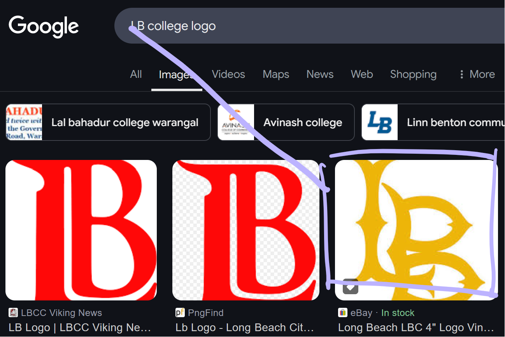

didn't expect to get 2nd LOL

# Welcome
## Welcome 0x2 [100]
we're told to score 10k on the main page's snake game:

no way im doing that! let's look for the source code\
f12, ctrl+u and right click is blocked,  but we can use view-source:https://ctf.scint.org, then ctrl+f\

and there's our flag! `THJCC{Sn4ke_G4me_Mast3r}`

## Discord 0x2 [100]
run get_flag command using the bot... let's use slash commands!

mfw you can't right click on bot messages to copy text\
flag: `THJCC{🇩 🇮 🇸 🇨 ⭕ 🇷 🇩 🚀 🚀 🚀 💥 💥 }`

# Crypto
surprisingly not that difficult (except for the one in insane section i'm bad with lattices)
## S-box [100]
i was expecting an aes chall whyyyyyy\
basically just get the index in Sbox for each byte, then turn the indices into characters

which produces `VEhKQ0N7MXRfSU5ERTNkX0MwbkZ1U2VkX01lfQ==`, decode from b64 get `THJCC{1t_INDE3d_C0nFuSed_Me}`

## girlfriend [220]
cipher stack... smh....

3x base64 + rot47 + rot13 gives our flag `THJCC{1_l0v4_y0U}`

## Double Secure [360]
we're given:

and that the message was signed twice, using different public keys:

$$
\begin{aligned}
c_1 \equiv m^{e_1}\ (mod\ N_1) \\
c_2 \equiv m^{e_2}\ (mod\ N_2)
\end{aligned}
$$
some few observations can be made:
1. \(N_1\) and \(N_2\) are the same, let's call them both \(N\)
2. \(gcd(e_1, e_2) = 5\), which is suspiciously small

using gcd, we can derive the following by [Bézout's identity](https://en.wikipedia.org/wiki/B%C3%A9zout%27s_identity):

$$a \cdot e_1 + b \cdot e_2 = 5 \; (a, b \in \mathbb{Z})$$
let's mess with the equations to make use of above:

$$
\begin{aligned}
c_1^a \equiv m^{ae_1}\ (mod\ N) \\
c_2^b \equiv m^{be_2}\ (mod\ N) \\
c_1^{a}c_2^{b} \equiv m^{ae_1 + be_2}\ (mod\ N) \\
c_1^{a}c_2^{b} \equiv m^{5}\ (mod\ N) \\
m^{5} = c_1^{a}c_2^{b} + kN \; (k \in \mathbb{N}_0)
\end{aligned}
$$

which we can just bruteforce k until we can take the 5th root of m! 

flag: `THJCC{wait_what?}`

## Shuffle Hell [450]
the encryption process is simply:
1. for each i, initialize cipher as flag
2. for each j (layer), xor an element from current layer twice with two shuffled mappings as indices

on a smaller scale, each loop's operation is as follows:

$$
\begin{aligned}
c_1 = m \oplus layer_{0,2}\oplus layer_{0,2}\oplus layer_{1,2}\oplus layer_{1,1}\oplus layer_{2,0}\oplus layer_{2,0} \\
c_2 = m \oplus layer_{0,0}\oplus layer_{0,0}\oplus layer_{1,1}\oplus layer_{1,0}\oplus layer_{2,1}\oplus layer_{2,2} \\
c_3 = m \oplus layer_{0,1}\oplus layer_{0,1}\oplus layer_{1,0}\oplus layer_{1,2}\oplus layer_{2,2}\oplus layer_{2,1}
\end{aligned}
$$

notice that the shuffled mapping spans through 2nd index, and there are two mappings\
recall XOR's properties:
- commutativity: \(A \oplus B = B \oplus A\), reordering
- involution: \(A \oplus B \oplus B = A\), cancelling out repeats

since we want to cancel out the shufflings, lets xor all the ciphertexts together and reorder:

$$
\begin{aligned}
c = m \oplus layer_{0,0}\oplus layer_{0,0}\oplus layer_{1,0}\oplus layer_{1,0}\oplus layer_{2,0}\oplus layer_{2,0}\oplus   \\
m \oplus layer_{0,1}\oplus layer_{0,1}\oplus layer_{1,1} \oplus  layer_{1,1}\oplus layer_{2,1}\oplus layer_{2,1}\oplus\\
m \oplus layer_{0,2}\oplus layer_{0,2}\oplus layer_{1,2}\oplus layer_{1,2}\oplus layer_{2,2}\oplus layer_{2,2}
\end{aligned} \\
c = m
$$

which would get us the flag!


flag: `THJCC{Xor_FoR_m4nY71M3}`

# Misc
## png chunk [260]
we're given Flag.png. we have our flag!

...except it's cut off. let's use pngcheck to investigate:

seeing this i opened HxD to check:

that's an IDAT chunk! which is a part of image data\
how can we view it? according to [libpng.org](http://www.libpng.org/pub/png/spec/1.2/PNG-Chunks.html):
> There can be multiple IDAT chunks; if so, they must appear consecutively with no other intervening chunks.

so we can just concatenate the missing IDAT chunk after the one in the image!\
lets understand IDAT's structure first:

which means we need to jump 4 + 4 + 0xffa5 + 4 bytes, then paste the missing chunk

and then we can view it!

flag: `THJCC{PN6_@$_Y0U_LooK_so}`

## Sumire hime [460]
never thought my webriddle instincts would come into play\
we're only given this and 2 hints (and another useless one):
> u know that? \
> Sumire hime is a sword! \
> Can you tell me what the type of the sword?

> Hint 1: SlashBlade is THE BEST Minecraft mod. \
> Hint 2: The author lives in Taiwan.

the solution is just to be dumb\
first get your google to be in taiwan region for easier searching\


lets find the words for "Sumire hime" and "sword"!\
searching "sumire hime" leads to [this website](https://vndb.org/c55687), giving us 菫姫. we can just translate sword into 劍\
searching 菫姫劍 leads to [the video we want](https://youtu.be/x27Tiu2jdlE?si=PCt9QNdYXD4gK2cP)\
flag: `THJCC{https://youtu.be/x27Tiu2jdlE}`

btw knowing that quoting things forces results to include the quoted phrase actually trolls you, since these two characters are both wrong lol (website above gave 菫姫 but video title uses 堇姬)\
this is Not even osint its literally just mindreading

## Happy College Life [460]
obligatory geoguessr challenge\
using exiftool on the image returned nothing useful, so we actually need to look with our eyes\
to begin, we need to find some landmarks that gives the location away\
which we can see a logo here:

these letters can be LB or bB, but having both cases present is unlikely, so we'll pick the former\
we can then search "LB college logo", go into google images and look for matches\

that looks like it!\
searching "long beach college" returns [Long Beach City College](https://en.wikipedia.org/wiki/Long_Beach_City_College) and [California State University, Long Beach](https://en.wikipedia.org/wiki/California_State_University,_Long_Beach), but only the latter logo matches, so it's that\
but how do we find the location? you don't. remember challenge only requires **precision up to the minutes**, and a minute is big enough for us to bruteforce\
bruting 33°46N and 33°47N, 118°06W and 118°07W gives our flag `THJCC{3346N,11807W}`

# Pwn
im actually dogwater at pwn how did i solve 2
## Peek a char [210]
we have a binary file and source code:

hmm.. the flag is just behind our input array. lets input negative numbers! below is how i automated this:


flag: `THJCC{i_ThoU9HT_i_W@S_well_HIdDen_QQ}`

## Infinite Recursion [350]
we have a binary file and source code:

fsb stands for format string bug and bof stands for buffer overflow\

PIE is enabled, which means our base address will be randomized\
so we have 2 parts:
1. **finding base address**\
we can use fsb for this by bruteforcing `%1$p`, `%2$p` and so on\
which we can find **%9$p** points to rand_fun+35!\
let's say it's `0x5555555552d9`, then the /bin/sh line would be `0x555555555375`, giving an offset of **0x9c**
2. **modify return address**\
buffer size is 0x10 bytes, and it's 64-bit so add 0x8 bytes for frame pointer, then add the address from fsb + 0x9c\
payload is as follows:


flag: `THJCC{E$C4Pe_FRoM_TH3_InF!NI7E_r3CURS!on}`

# Reverse
## BMI Calculator [110]
we're given a binary file: input weight and height, get bmi and flag\
opening in IDA reveals the flag is encrypted:
```c
v7[3] = __readfsqword(0x28u);
v7[0] = 0x581E51696960627ELL;
v7[1] = 0x1942755F1A537519LL;
v7[2] = 0x571553421D461ELL;
```
and an uncalled decrypt flag function
```c
size_t __fastcall decrypt_flag(const char *a1)
{
  size_t result; // rax
  int i; // [rsp+1Ch] [rbp-14h]

  for ( i = 0; ; ++i )
  {
    result = strlen(a1);
    if ( i >= result )
      break;
    a1[i] ^= 0x2Au;
  }
  return result;
}
```
so just [xor every byte with 0x2A](https://gchq.github.io/CyberChef/#recipe=Fork('%5C%5Cn','',false)From_Hex('Auto')Reverse('Character')XOR(%7B'option':'Hex','string':'2a'%7D,'Standard',false)&input=NTgxRTUxNjk2OTYwNjI3RQoxOTQyNzU1RjFBNTM3NTE5CjU3MTU1MzQyMUQ0NjFF) lol\
flag: `THJCC{4r3_y0u_h34l7hy?}`

## locked unlocker [250]
we're given `locked-unlocker.cpython-310.pyc`\
filename indicates python 3.10, so [lets use pycdc](https://github.com/zrax/pycdc)\
after some patching we try to run it:
```
Starting decryption...
Decrypting |████████████████████████████████████████| 256/256 [100%] in 16.7s (15.40/s)
b'\x89PNG\r\n\x1a\n\x00\x00\x00\rIHDR...
```
its a png! write it to a file


flag: `THJCC{BABy_PYC_rEvErSe}`

## You know I know the token [310]
we're given a binary file, where u can register/login and get/input token\
opening in IDA we can see we're prevented from registering "Administrator"

however we can patch jnz's code 75 with jz's code 74! lets patch it and run:\

flag: `THJCC{Unm4sK1n6_7He_shA256_al9o}`

# Web
## notepad+++ [100]
we're given a note website where we can edit the text and view it

checking code, we notice that our session is md5-encrypted, but the server doesn't actually check if it's md5 or not\

which means we can LFI with session cookie!

flag: `THJCC{tmp_1n_🐍_01b4c87cabcca82b}`

## proxy revenge [300]
we're given a proxy and we need to connect `http://secret.flag.thjcc.tw` for flag

these two lines stand in the way, but easily bypassable:
- scheme.startsWith('https') only checks if the raw string starts with exactly that, and doesn't do any filtering\
which means we can just do ' https' or 'hTtps'
- the host is appended with `.cggc.chummy.tw`, but we can make that a query `?` or use a `#` to render that useless

final payload: `http://cha-thjcc.scint.org:10068/fetch?scheme=%20http://&host=secret.flag.thjcc.tw/?a=&path=/`

flag: `THJCC{N0...K42E 5En5171v17Y 12 RE4LLY 1Mp0R74n7.}`

## login panel [430]
we're given a website and the login script:

sql injection doesnt seem possible, so i found [this](https://blog.csdn.net/niexinming/article/details/84889275) started sending nonstring types in login data, and accidentally solved it\

lmao\
apparently this is not how u solve it, but ill try to explain this tmrw

# Insane
## Blog Revenge [400]
> Blog was the best challenge in THJCC, but now the revenge one would be the best!\
> Try to run readflag on my new blog (RCE m3 plz)\
> Author: whale.120

analyzing the website we see that the gif is fetched by `/getimage?img=fido_hello.gif`, which i thought was a sign of LFI\
i tried `../etc/passwd` and kept prepending `../`, and hit `../../etc/passwd`\
i then just guessed `../../app/app.py` and hit the server code (and copied all files to run locally lol)\

app.py reveals a secret /test-find-panel, which has a possible RCE\
i added below two lines for better testing:
```py
print(subprocess.list2cmdline(find_query), flush=True)
print(find_query, flush=True)
```
naively i tried to use || to execute extra command and fail the find command

works on local but not on server, so i figured the subprocess command only allows us to pass find arguments\
though find command actually has **-exec**! with a condition:
> All following arguments to find are taken to be arguments to the command until an argument consisting of `;' is encountered.

so end the payload in an arbitrary argument with value `;`\
`-exec "./readflag" -hahaiwin ;` -> `?exec=./readflag&hahaiwin=;`

uh oh! we need to send 2 too\
simply using a pipe wouldnt work, cause find will interpret the whole string as a filepath:
`-exec "echo '2' | ./readflag" -hahaiwin ;` -> `?exec=echo%20%272%27%20|%20./readflag&hahaiwin=;`
```
2024-12-22 01:30:05 find . -exec "echo '2' | ./readflag" -hahaiwin ;
2024-12-22 01:30:05 ['find', '.', '-exec', "echo '2' | ./readflag", '-hahaiwin', ';']
2024-12-22 01:30:05 find: ‘echo '2' | ./readflag’: No such file or directory
```
however we can use `sh -c`! which works with string input
`-exec sh -c "echo '2' | ./readflag" -hahaiwin ;` -> `?exec=sh&c=echo%20%272%27%20|%20./readflag&hahaiwin=;`

yay! flag: `THJCC{argument_injection_never_die}`